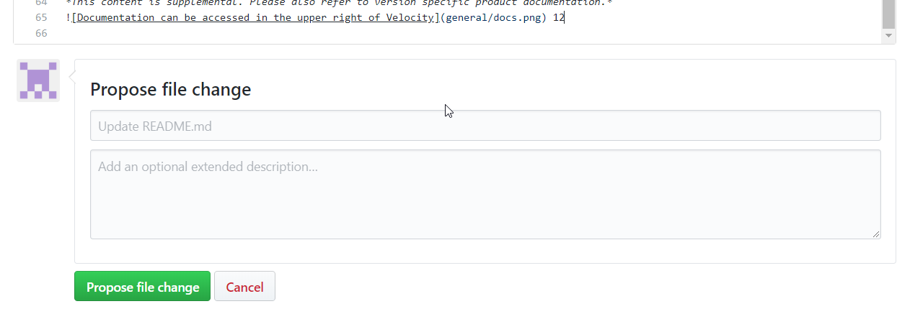

# UrbanCode Velocity Info

A common realm for practical usage of UrbanCode Velocity.

## [https://urbancode.github.io/velocity-info](https://urbancode.github.io/velocity-info)

# How to Contribute

- Create an Issue (describe a use case, technique, or problem)

- Propose changes with a PR (direct addition or modification of content pending review)

# Need Help with Markdown? Learn more about it Here!

This repo uses GitHub MarkDown:
https://guides.github.com/features/mastering-markdown/

# Product Documentation

*This content is supplemental. Please also refer to version specific product documentation.*

#### [>> HCL Documentation](https://urbancode.hcldoc.com/)
#### [>> IBM Documentation](https://www.ibm.com/support/knowledgecenter/SSCKX6)
#### Also checkout the Velocity Website! :) [http://www.urbancode.com/](http://www.urbancode.com/)

