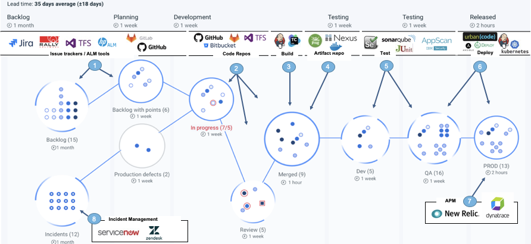

*Practical information for using UrbanCode Velocity*

# Product Documentation

*This content is supplemental. Please also refer to version specific product documentation.*

#### [>> HCL Documentation](https://urbancode.hcldoc.com/)
#### [>> IBM Documentation](https://www.ibm.com/support/knowledgecenter/SSCKX6)

#### Also checkout the Velocity Website! 😀 [http://www.urbancode.com/](http://www.urbancode.com/)

# [FAQ (Frequently Asked Questions)](FAQ.md)

 

# Workbooks

## 1. [Introduction to Value Streams](workbooks/introductionToValueStreams.md)   

 

# Feature Overviews

 

# Advanced Concepts

- ## [API Usage](apiDocs/release-events-api_API_docs.md)
- ## Example Value Stream Map (VSM) json

 

# How to Contribute

1. Go to the velocity-info Issues page: https://github.com/UrbanCode/velocity-info/issues
2. Create a new Issue describing your use case, technique, or problem.

3. Or, if you have a solution, propose changes with a Pull Request: https://github.com/UrbanCode/velocity-info/pulls

