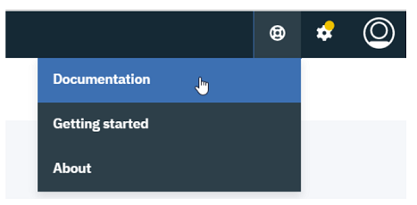
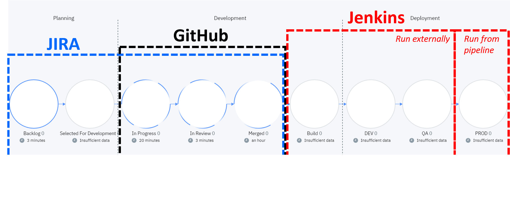
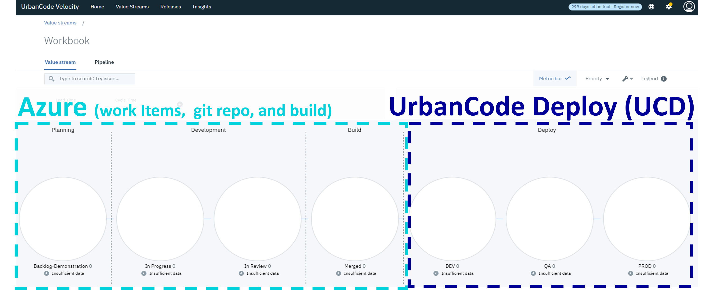

NOTE: This content is geared towards community engagement. Please refer to version specific product documentation for details.

#### \>> Also, look for the help icon in the upper right of Velocity's header to find links to Documentation, Getting started, and About information.

---

# Workbooks

### 1. [Building a Value Stream with Jira, GitHub, and Jenkins](workbooks/introductionToValueStreams.md) 

### 2. [Building a Value Stream with Azure and UCD](workbooks/azureUcdValueStreams.md) 

# General Content
- ### [API Usage](apiDocs/release-events-api_API_docs.md)
- ### [How to Migrate Docker-Compose to Kubernetes](docker-compose_to_kubernetes.md)
---

## How to Contribute

Your contributions are welcome and appreciated! 🙂

**Create an Issue**   
The easiest way to contribute is by asking and/or answering a velocity-info issue (5 points and a gold star ⭐ if you ask and answer your own question).

These are not product issues, but a way to contribute to user content, so topics are very open. For instance, you might request new content like a workbook, suggest supplementary info, or describe a hurdle and/or solution.

Issues are highly searchable, so make sure to search for a related issue before posting a new one. Also, because of this, you can use velocity-info issues as a sort of Q&A.

Just click on the "Issues" tab from the repository or the link here to get started: <https://github.com/UrbanCode/velocity-info/issues>

