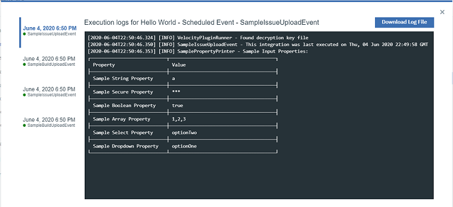

#### This page is a simple way to share working knowledge. Refer to the [Knowledge Center](https://www.ibm.com/support/knowledgecenter/SSCKX6) for official documentation. You can also look under the help icon in the upper right of Velocity's header for a documentation link.

### Suggest & vote for product features - [Join the RFE community](https://www.ibm.com/developerworks/rfe/execute?use_case=searchRFEs&SELECTED_SEARCH_TAB=TAB1&SPECIFY_PRODUCT_TYPE=SPECIFY_PRODUCT_ONLY&BRAND_ID=90&PROD_FAM_ID=675&BRAND_ID_SEARCH=90&PROD_FAM_ID_SEARCH=675&PROD_ID_SEARCH=20136&COMP_ID=416&CREATED_BY=&KEYWORDS=&KW_TYPE=1&START_DATE=&STOP_DATE=&CR_ID=&COMPANY=&GROUP_ID=&rfenumber=id&PAGE=1&ITEMS_PER_PAGE=20&SORT_BY=RESP_ID&SORT_ORDER=ASC&HIDE_DESCRIPTIONS=true&is_javascript_enabled=false)

Login with your IBM ID to vote for product features, or share a new idea with the community. If you do not have an IBM ID, simply create one.

### Learn more about UrbanCode Velocity, DevOps, and Value Streams at urbancode.com
- [Velocity plugins](https://www.urbancode.com/plugins/?search=&product_filter%5B%5D=811)
- [Release Notes](https://www.urbancode.com/whats-new/?search=&product_filter%5B%5D=811&post_type_filter%5B%5D=release_note)
- [Blogs and Videos](https://www.urbancode.com/resources/?search=&product_filter%5B%5D=811)

### Other Helpful Links
- Getting Started (Free Trial): [https://www.urbancode.com/getstarted/](https://www.urbancode.com/getstarted/)
- Passport Advantage (Product Licensing): [https://www.ibm.com/software/passportadvantage/](https://www.ibm.com/software/passportadvantage/)
- Velocity Installer Download:
  - [Linux](https://www.urbancode.com/uc-downloads/Velocity/latest/velocity-ibm-install-latest-linux)
  - [Mac](https://www.urbancode.com/uc-downloads/Velocity/latest/velocity-ibm-install-latest-macos)
  - [Windows](https://www.urbancode.com/uc-downloads/Velocity/latest/velocity-ibm-install-latest-win.exe)
  - [All versions](https://www.ibm.com/support/fixcentral/swg/selectFixes?parent=ibm%7ERational&product=ibm/Rational/IBM+UrbanCode+Velocity&release=All&platform=All&function=all)
- Support: [https://www.ibm.com/support/home/](https://www.ibm.com/support/home/)
- Forum: [https://www.ibm.com/mysupport/s/forumsproduct](https://www.ibm.com/mysupport/s/forumsproduct?language=en_US&name=UrbanCode+Velocity&id=0TO50000000QVw6GAG)

---

# Tutorials and Workbooks

### 1. [Building a Value Stream with Jira, GitHub, and Jenkins](workbooks/introductionToValueStreams.md) 

### 2. [Building a Value Stream with Azure and UCD](workbooks/azureUcdValueStreams.md) 

### 3. [Plugin SDK Hello World](plugin-sdk/helloWorld.md)

# Guides
- ### [API Usage](apiDocs/release-events-api_API_docs.md)
- ### [How to Migrate Docker-Compose to Kubernetes](docker-compose_to_kubernetes.md)
---

## How to Contribute

Your contributions are welcome and appreciated! 🙂

**Create an Issue**
The easiest way to contribute is by asking and/or answering a velocity-info issue (5 points and a gold star ⭐ if you ask and answer your own question).

These are not product issues, but a way to contribute to user content, so topics are very open. For instance, you might request new content like a workbook, suggest supplementary info, or describe a hurdle and/or solution.

Issues are highly searchable, so make sure to search for a related issue before posting a new one. Also, because of this, you can use velocity-info issues as a sort of Q&A.

Just click on the "Issues" tab from the repository or the link here to get started: <https://github.com/UrbanCode/velocity-info/issues>

