# UrbanCode Velocity Plugin SDK - Hello World Tutorial

UrbanCode Velocity supports a large number of plugins out-of-the-box, and more every day. However, sometimes DevOps teams want to go a step further. The plugin SDK is the perfect solution. You can easily get started with the plugin SDK by downloading the template project. This Hello World tutorial walks you through the basic steps of building a new plugin.

## 1. Download the Plugin Template Project

  1. In Velocity navigate to the plugins page (Settings --> Integrations), click “Plugins”
  2. Click “Download Sample plugin” to download a sample project as a tar file
  3. Unpack the tar file

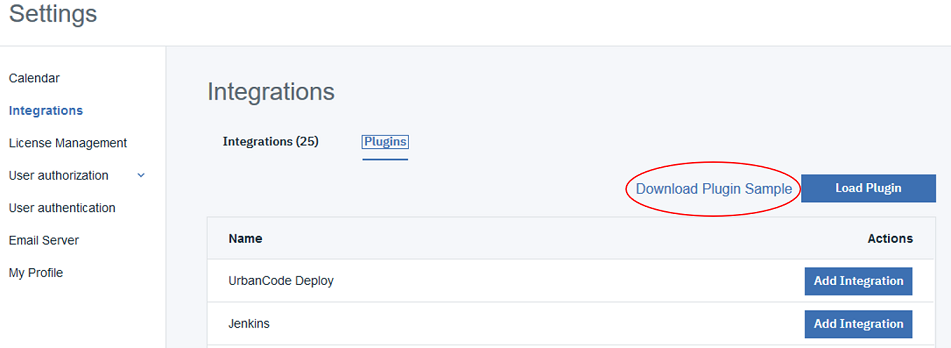

## 2. Edit the Project

The tar file should unpack a Node.js project folder. One popular editor for Node.js projects is [Visual Studio Code](https://code.visualstudio.com/), but you can use any editor you choose. This tutorial will focus on two files: `package.json` and `index.js`.

**package.json**: The primary point of configuration for Node projects and Node Package Manager (npm). We can change our project name and version here, as well as see dependencies and scripts.

change the following project details...

*from*

```json
  "name": "ucv-ext-sdk-template",
  "version": "0.1.2",
  "description": "Template plugin for UrbanCode Velocity",
```

*to*

```json
"name": "ucv-ext-hello-world",
"version": "0.1.0",
"description": "Plugin SDK Hello World",
```

**index.js**: Typically the main entry point of the Node project. For Velocity plugins, however, the index.js file contains the manifest/configuration of the plugin. Plugin configuration should be changed similar to what is shown below...

*from*

```javascript
  displayName: 'Sample Template Plugin', // How the plugin shows in the UI
  pluginId: 'ucv-ext-sdk-template', // Must match the 'name' in package.json
  description: 'This is a template for basic npm plugin packages for UrbanCode Velocity.'
```

*to*

```javascript
  displayName: 'Custom Plugin - Hello World', // How the plugin shows in the UI
  pluginId: 'ucv-ext-hello-world', // Must match the 'name' in package.json
  description: 'A custom plugin created from the Hello World tutorial.'
```

> OPTIONAL: If you are familiar with Node.js development, you may want to dive deeper and add, edit, and/or remove the plugin "interfaces" (endpoints, scheduled events, and quality handlers) configured from index.js; however, the initial implementation is a good test case so you may want to proceed and circle back to this as a follow-up exercise.

```javascript
  endpoints: [sampleMetricsEndpoint, secondSampleEndpoint],
  scheduledEvents: [sampleIssueUploadEvent, sampleBuildUploadEvent],
  taskDefinitions: [], // Currently not supported
  eventTriggers: [], // Currently not supported
  qualityHandlers: [sampleMetricsHandler],
```

## 3. Build the Docker Image

Run the docker build command from a terminal/shell in the template project directory.

`Docker build . -t ucv-ext-hello-world:0.1.0`

It is not required, but you can also build the project locally to check for build errors. To do this run `npm install` and `npm run dist-runnable`.

## 4. Ensure that the Plugin's Docker Image is available to Velocity's instance of Docker

This tutorial assumes that you created the Docker image on the same instance as Velocity. You can verify this by running the following command from Velocity's instance of Docker (or you could just try installing the plugin from Velocity's UI):

`docker image ls | grep ucv-ext-hello-world`

If this was not the case, you can migrate the image a number of ways, depending on your situation. Refer to docker documentation. You may want to take a look at [docker save](https://docs.docker.com/engine/reference/commandline/save/) and [docker load](https://docs.docker.com/engine/reference/commandline/load/). In some cases you may prefer [docker push](https://docs.docker.com/engine/reference/commandline/push/) and/or [docker pull](https://docs.docker.com/engine/reference/commandline/pull/) to get the image over to Velocity's Docker instance.

## 5. Install the Plugin in Velocity

  1. In Velocity navigate to the plugins page (Settings --> Integrations), click “Plugins”
  2. Click “Load Plugin"
  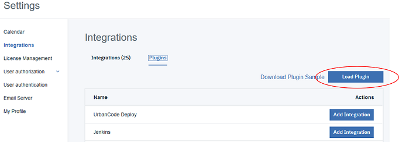

  3. Provide the image tag and version formatted as `image-name:image-version`. For this tutorial use `ucv-ext-hello-world:0.1.0`
  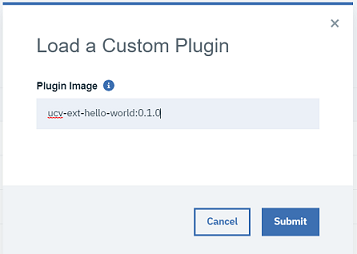

Your new plugin should now be available. You can confirm by check the status and last execution time. You should also be able ot see the logs per execution.

## 6. Create an Integration from the Plugin

### 6.1 Create an Access key

Before creating the integration, create an access key to use later.

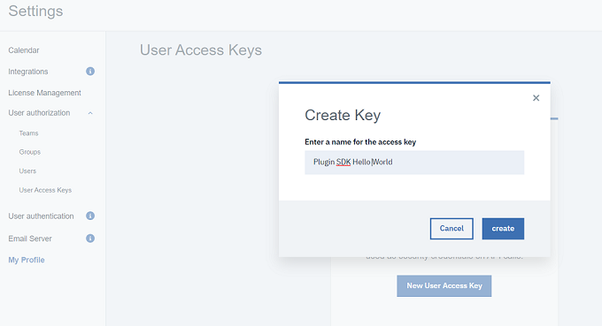

### 6.2 Click "Add Integration"

The plugin should be listed in the plugins list. Click "Add Integration"

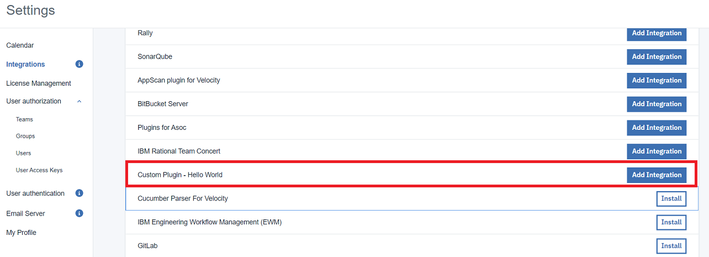

### 6.3 Configure Integration Properties

Provide the integration properties. For this tutorial, check the box for "Upload Sample Data" and provide the access key we created.

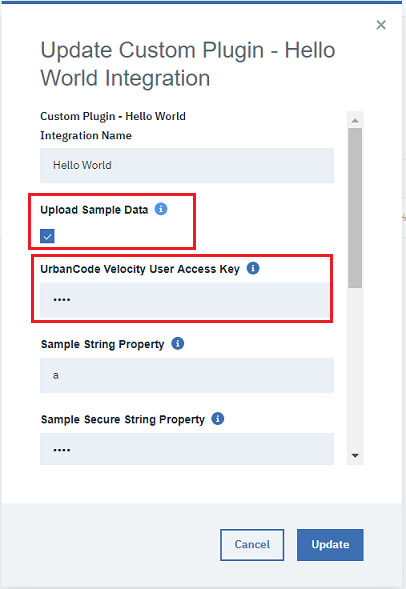

The remaining properties do not matter.

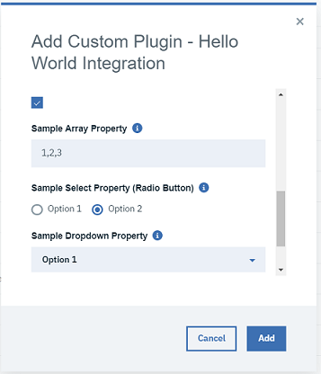

## 6. Confirm the Integration

Confirm that the integration was created and inspect the integration details.

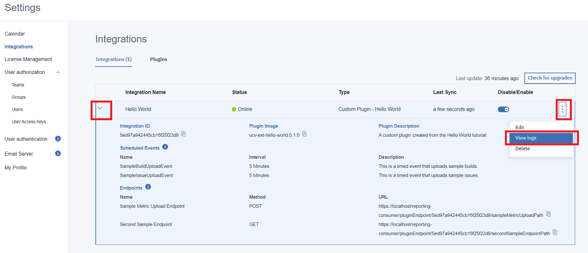

Wait for the integration to run or toggle disable/enable to force it to run. Inspect the integration logs.


> At this point you have successfully verified your custom plugin creation and execution. Step 7 is optional to begin working with sample data in a value stream.

## 7. Optional - Confirm VSM Sample Data

### 7.1 Create a New Value Stream
  
Navigate to value streams and create a new value stream.

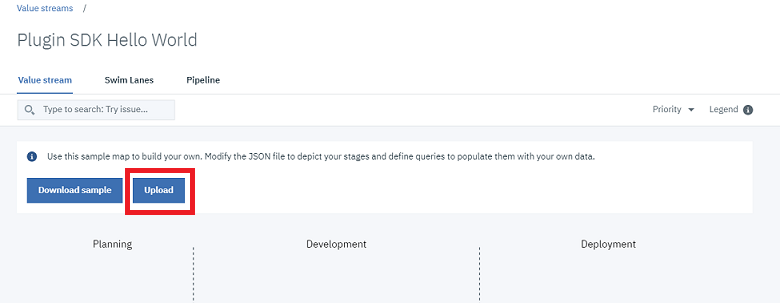

### 7.2 Create vsm.json file

Copy and past the "value stream map" json below into a .json file. This is referred to as a "vsm.json file". Name it something like "plugin-sdk-hello-world-vsm.json".

```json
{
  "_id": "5ed7bf9fdec823459e34c93d",
  "pipelineId": "f0ceab78-387b-4ae6-b639-7c38f395ebd5",
  "tenantId": "5ade13625558f2c6688d15ce",
  "description": null,
  "query": "",
  "phases": [
    {
      "name": "Development",
      "description": "",
      "stages": [
        {
          "name": "In Progress",
          "query": "issue.url = \"https://urbancode.com\"",
          "description": "",
          "wipLimit": 10,
          "gates": null
        }
      ]
    }
  ],
  "leadTime": { },
  "cycleTime": { },
  "mappings": {
  },
  "integrations": [
      {
        "name": "Hello World"
      }
  ],
  "linkRules": [],
  "metrics": null,
  "metricsBar": null
}
```

### 7.3 Upload the vsm.json file

Upload this vsm.json file to the value stream by clicking "Upload".

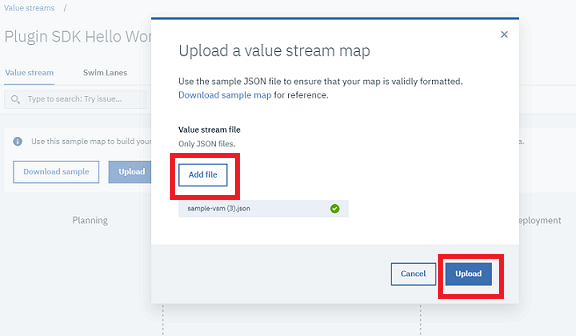

### 7.4 Verify Sample Data

The value stream should show a single stage with two dots produced by the integration.

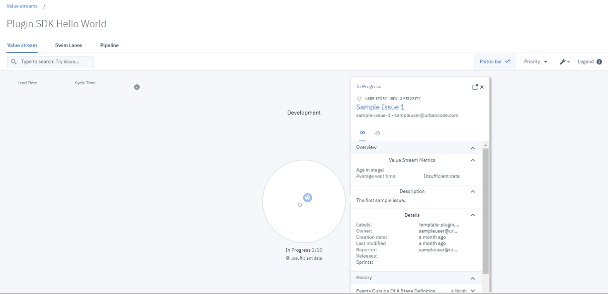

## Next Steps

You are now ready to dive deeper into the template project! Checkout the template project `README.md` file to learn more.
