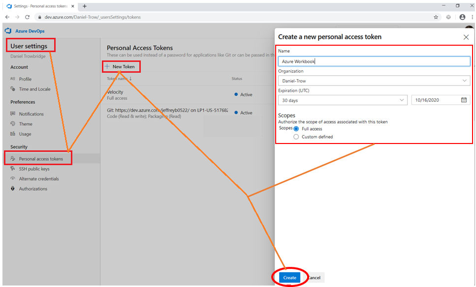

 # Creating an Azure and UrbanCode Deploy (UCD) Value Stream 

## Objective
Create a value stream with Azure and UrbanCode Deploy integrations and exercise it from beginning (a new issue) to end (deployment to Prod).

## Workbook Guidelines

**< > Placeholders/Substitution**

Placeholders should be indicated with angle brackets "<" and ">". For instance, if the workbook says navigate to `"https://dev.azure.com/\<your org name\>"`, and your Azure organization name is "SkyScubaDiving", then navigate to `"https://dev.azure.com/SkyScubaDiving"`.

**🔀 Alternative Paths**
Workbooks should guide users beyond rote exercise towards exploration and discovery. As you go through the workbook, there are certain steps intended to simplify the process; however, some alternative paths will be called out along the way.


---

**Table of Contents**
- [Setting up Azure](#Setting-up-Azure)
- [Azure Value Stream: From Planning to Merge](#Azure-Value-Stream:-From-Planning-to-Merge)

---


### 1. Setting up Azure

Requirements: 
  - Azure account with ability to create a new project.

#### 1.1 Create a New Azure Project 

Navigate to `https://dev.azure.com/<your org name>` and click "New Project"


Configure your new project as follows:
  - *Project Name:* AzureWorkbook
  - *Visibility:* Private
  - *Version Control:* Git
  - *Work item process:* Agile


(🔀 Alternative: See how far you can get with an existing project)

#### 1.2 Initialize Azure Repo

In your new project, navigate to "Repos" to create a new repository. It can be the bare minimum, so select "initialize with a README or gitignore".


Confirm that your repo has been created.


#### 1.3 Setup Azure Pipeline

We also want an Azure pipeline in this workbook to represent our build step. We need to set that up with a little secret sauce: we want successful runs to tag our repo.

1. Navigate to Pipelines and click "Create Pipeline"


2. Select "Azure Repos Git" for code source.


3. Select the workbook repository for the pipeline.


4. The default "hello world" .yml is good enough for us. Click save (avoid running for now).


5. If auto-navigated to the pipeline view, click edit.


If you happen to navigate away you should be able to come back and still click edit.


6. After clicking edit you should see the yml. Click on the stacked dots dropdown and click "Triggers".


7. There's a lot to unpack under "Triggers", but we're going to be laser focussed on one thing right now. Click "YAML" on the left of the upper horizontal tabs. Click "Get Sources" under YAML. Scroll down in the menu that shows on the right. Under "Tag sources" click "On Success". Go ahead and click "Save & queue". Our pipeline should now create repository tags for successful builds, and since we queued it, we should have a build pending.


8. Confirm that our pipeline ran successfully and created a tag for our repository.


#### 1.3 Create an Azure Access Token

Navigate to `https://dev.azure.com/<your org name>/_usersSettings/tokens`


Create a new token. Give it a reasonable name an expiration date for your usage. The easiest option is to select "Full Access". Make sure to copy and save your key (you'll need it later in Velocity).



### 2. Setting Up Velocity

Requirements: 

- Access to Velocity user with full permissions.


#### 2.1 Create a Velocity User Access Key

Navigate to `<Velocity URL>/settings/myprofile` to create a user access key. Name the key so you can identify and delete it later if needed. Make sure to copy the access key for future use.


#### 2.2 Create the Azure Integration

Navigate to `<Velocity URL>/settings/integrations`. Click "Plugins" and click "Add Integration" for the Azure plugin.


  - *Integration Name:* Use "AzureWorkbook" for this workbook.
  - *Loggin level:* "INFO"
  - *UrbanCode Velocity User Access Key:* Use the velocity user access key that was just created in section 2.1 above.


  - *URL:* This example uses https://dev.azure.com
  - *Username:* What you use to login to Azure. Usually an email address.


  - *Password:* leave blank (using access token instead)
  - *Access Token:* Paste the Azure access token we created earlier.


  - *Organization:* You Azure organization name. Can be obtained and confirmed with your Azure home URL: `https://dev.azure.com/<your org name>`.
  - *Project:* Your Azure project name. Use "AzureWorkbook" for the workbook. This can be derived and confirmed against the project URL: `https://dev.azure.com/<your org name>/<project name>`
  - *Repositories:* You Azure repository (repo) name. Use "AzureWorkbook" for the workbook. This can be derived and confirmed against the repo URL: `https://dev.azure.com/<your org name>/_git/<repo name>`


Depending on your version of Velocity you might see an extra field for "Logger Level" at the button of the form. You can leave this blank.


#### 2.3 Create a Dummy Integration

Because of the way we are going to configure our value stream, this workbook requires a dummy integration. Add another integration from the integrations page by Clicking on "Plugins" and "Add Integration" for GitHub for instance. Name the integration dummyIntegration. The rest of the configuration can be anything so long as it gets created. We should now have two integrations: "AzureWorkbook" and "dummyIntegration".

#### 2.3 Create a New Value Stream

  1. Navigate to the *Value Streams* page and click "Create"   

  2. Name your value stream and select a team for it. The workbook uses the name **"Azure Workbook"** and **"Default Team"**. A value stream description is optional.   


| Field | Description | Required | 
|-------|-------------|----------|
| Name | value stream name. | yes |
| Description | value stream description | no | 
| Team | Team of users who can access this value stream. | yes | 

#### 2.4 Configure your Value Stream with a vsm.json file

UrbanCode Velocity value streams are fully configurable by downloading and uploading a value stream map (VSM) json file. Save the vsm.json content provided below as a .json file. We will then upload this file to configure our value stream.

##### 2.4.1 Create a vsm.json file for this workbook
> **Because this json content references integrations by name, the integrations must be created and named correctly before uploading it.**

```json
{
  "tenantId": "5ade13625558f2c6688d15ce",
  "phases": [
    {
      "name": "Planning",
      "stages": [
        {
          "name": "Backlog-Demonstration",
          "query": "issue.status='New'"
        }
      ]
    },
    {
      "name": "Development",
      "stages": [
        {
          "name": "In Progress",
          "query": "(issue.status=\"Active\" and pr.status!=\"active\" and pr.status!=\"completed\") or (pr.status=active and (pr.labels='do not merge' or pr.labels=\"don't merge\"))"
        },
        {
          "name": "In Review",
          "query": "pr.status=active and issue.status!=\"Closed\" and (pr.labels!='do not merge' and pr.labels!=\"don't merge\")"
        }
      ]
    },
    {
      "name": "Build",
      "stages": [
        {
          "name": "Merged",
          "query": "(build.status = 'success' build.status = 'failure') and deployment.env != 'DEV' and deployment.env != 'QA' and deployment.env != 'PROD' and pr.status = 'completed'"
        }
      ]
    },
    {
      "name": "Deploy",
      "stages": [
        {
          "name": "DEV",
          "query": "deployment.env = 'DEV' and deployment.env != 'QA' and deployment.env != 'PROD' and pr.status = 'completed'"
        },
        {
          "name": "QA",
          "query": "deployment.env = 'QA' and deployment.env != 'PROD' and pr.status = 'completed'"
        },
        {
          "name": "PROD",
          "query": "deployment.env = 'PROD' and pr.status = 'completed'"
        }
      ]
    }
  ],
  "integrations": [
    {
      "name": "Azure2"
    },
    {
      "name": "NotReal"
    }
  ],
  "linkRules": [
    {
      "fromIntegrationName": "Azure2",
      "toIntegrationName": "Azure2",
      "fromField": "pr.name",
      "toField": "issue.id",
      "pattern": "([0-9]+)"
    }
  ]
}
```

> **_Explanation of VSM JSON_**
> - **Integrations Array**   
> This vsm.json content defines an integration for Jira. Integrations are included based on integration name. This workbook uses the names **"AzureWorkbook"** and **"dummyIntegration"**. This part of the vsm.json needs changed if the integrations happen to be named differently.
>```json
>"integrations":[
>    {
>      "name":"AzureWorkbook"
>    },
>    {
>      "name":"dummyIntegration"
>    }
>]
> ```
>    
>    
> - **Phases and Stages**  
> Value streams are organized as phases and stages. The json file provides phase and stage definitions. An important part of stages are stage queries which logically define whether a work item (dot) should be included in a stage or not.
> ```javascript
>"phases":[
>  {
>    "name": "Planning",
>    "stages": [
>      {
>        "name": "Backlog",
>        "query": "issue.status=Backlog"
>      },
>      ...
>```
> 
>
>
>  - **Link Rules**
>  Link rules are important for this workbook. They define how pull requests (PRs) get linked to work items. In this case based on the regex pattern `([0-9]+)`.
>
>
>```javascript
>  "linkRules": [
>    {
>      "fromIntegrationName": "Azure2",
>      "toIntegrationName": "Azure2",
>      "fromField": "pr.name",
>      "toField": "issue.id",
>      "pattern": "([0-9]+)"
>    }
>  ]
>```
>


##### 2.4.2 Upload the vsm.json File

If you have a brand-new value stream, then the upload button will be directly available.


After the first vsm.json file is uploaded, the value stream can be modified with additional uploads via the tools and utilities dropdown option "Replace value stream map". 


After uploading the vsm.json file you should see the appropriate phases and stages in your value stream:


### 3. Azure Value Stream: From Planning to Merge

Shew, that was a lot of setup. Now let's get that dot moving!

> **Pro Tip**: We're about to do a lot of external activity to Velocity. To speed things up force your Velocity integration to sync with a disable/enable every time we change an external state (like create a work item or merge a PR)
>
> 


#### 3.1 Backlog (create a new work item)

As observed above, our value stream has a bunch of stages but no dots, that's perfectly accurate for our empty board in Azure. Click on "New Item" to create a new work item.


You can title this work item anything you like, the example below names it "do the workbook" and assigns it a work item ID of "5". **Take note of this work item ID (5 is shown here but for a first time workbook it's probably 1), we'll need it later.**


Once Velocity syncs up with Azure (disable/enable integration if you don't want to wait) you will see the dot show up in your backlog. Neat!


but why is it red, it seems a little upset 😡?... Aww, because it has an alert: "Issue not assigned".


Go ahead and assign it to someone back in Azure. Nothing like a little delegating to get the ball rolling (even if it is to yourself).


Now our dot is a happy little dot 😇 (and we see the beginnings of its history)


#### 3.3 In Progress

Turns out we already are doing the workbook, so grab that card from the backlog and move it to "active".


Wait for Velocity to sync (or force with disable/enable). The dot will move to "In Progress".


#### 3.4 In Review

Now that the card is active, we have to do some actual work to move the dot to review. That's a good thing; Velocity is a lot more than just moving cards around!

##### 3.4.1 Create a new Branch

Navigate to branches in Azure and click "New branch".


The branch name doesn't really matter; you can just name it "workbook". Click create.

##### 3.4.2 Make Changes to the Branch


Once the branch is created we can directly edit the `README.md` file from Azure. You can make any changes you want, like change the "Introduction" section to say "workbook". 


##### 3.4.3 Commit Changes

Once you've made changes click "Commit".


##### 3.4.4 Create Pull Request

After committing changes our branch is now different than master. That's great, we've added value! Click "Create a Pull Request".


For the most part, the Pull Request (PR) is fine with defaults, except one critical piece: we need the work item ID in the PR title. This is because we configured our value stream back in Velocity to link work items to PRs based on the work item ID in the PR title. The example here shows "5" but the ID for a new Azure project will be "1". Once correctly titled, click "Create" to create the PR.


##### 3.4.5 Observe Dot

Wait for Velocity to sync (or disable/enable integration). The dot will move from "In Progress" to "In Review".


#### 3.5 Merging Changes

You have reviewed your changes and lo, they are beyond perfect, even sublime. Your PR is approved, go ahead and merge (click "Complete").


merging defaults are fine, click "Complete merge"


Wait for Velocity to sync. The dot will move to "Merged".


### 4. UrbanCode Deploy Value Stream: Deployments

#### 4.1 Deploy to Dev

#### 4.2 Deploy to QA

#### 4.3 Deploy to Prod