# Creating an Azure and UrbanCode Deploy (UCD) Value Stream

## Objective
Create a value stream with Azure and UrbanCode Deploy integrations and exercise it from beginning (a new issue) to end (deployment to Prod).


## Workbook Guidelines

**< > Placeholders/Substitution**
Placeholders should be indicated with angle brackets "<" and ">". For instance, if the workbook says navigate to `"https://dev.azure.com/\<your org name\>"`, and your Azure organization name is "SkyScubaDiving", then navigate to `"https://dev.azure.com/SkyScubaDiving"`.

**🔀 Alternative Paths**
Workbooks should guide users beyond rote exercise towards exploration and discovery. As you go through the workbook, there are certain steps intended to simplify the process; however, some alternative paths will be called out along the way.

---

**Table of contents**

<!-- @import "[TOC]" {cmd="toc" depthFrom=1 depthTo=8 orderedList=false} -->

<!-- code_chunk_output -->
  - [Objective](#objective)
- [Creating an Azure and UrbanCode Deploy (UCD) Value Stream](#creating-an-azure-and-urbancode-deploy-ucd-value-stream)
  - [Objective](#objective)
  - [Workbook Guidelines](#workbook-guidelines)
- [1. Setup Azure](#1-setup-azure)
  - [1.1 Create Workbook Project](#11-create-workbook-project)
  - [1.2 Initialize Workbook Repository](#12-initialize-workbook-repository)
  - [1.3 Setup Workbook Pipeline](#13-setup-workbook-pipeline)
  - [1.4 Create an Azure Access Token](#14-create-an-azure-access-token)
- [2. Setup UCD](#2-setup-ucd)
  - [2.1 Create Workbook Component](#21-create-workbook-component)
    - [2.1.1 Configure Component to get Version from Azure](#211-configure-component-to-get-version-from-azure)
    - [2.1.2 Create Component Process](#212-create-component-process)
  - [2.2 Create Workbook Application with Component](#22-create-workbook-application-with-component)
    - [2.2.1 Create Application Process](#221-create-application-process)
    - [2.2.2 Create Environments](#222-create-environments)
  - [2.3 Create UCD Access Token](#23-create-ucd-access-token)
- [3. Setup Velocity](#3-setup-velocity)
  - [3.1 Create a Velocity User Access Key](#31-create-a-velocity-user-access-key)
  - [3.2 Setup UCD within Velocity](#32-setup-ucd-within-velocity)
    - [3.2.1 Create UCD Integration](#321-create-ucd-integration)
    - [3.2.2 Allow Time for UCD to Sync](#322-allow-time-for-ucd-to-sync)
    - [3.2.3 Add user to UCD Team](#323-add-user-to-ucd-team)
  - [3.3 Setup Azure within Velocity](#33-setup-azure-within-velocity)
    - [3.3.1 Create Azure Integration](#331-create-azure-integration)
    - [3.3.2 Upgrade Azure Integration](#332-upgrade-azure-integration)
  - [3.4 Create a Dummy Integration](#34-create-a-dummy-integration)
  - [3.5 Create a New Value Stream](#35-create-a-new-value-stream)
    - [3.5.1 Create a vsm.json file](#351-create-a-vsmjson-file)
    - [3.5.2 Upload the vsm.json File](#352-upload-the-vsmjson-file)
  - [3.6 Configure the Value Stream Pipeline](#36-configure-the-value-stream-pipeline)
    - [3.6.1 Add UCD to the Pipeline](#361-add-ucd-to-the-pipeline)
    - [3.6.2 Map Environments](#362-map-environments)
- [4. Use the Value Stream from Planning to Merged](#4-use-the-value-stream-from-planning-to-merged)
  - [4.1 Backlog](#41-backlog)
  - [4.2 In Progress](#42-in-progress)
  - [4.3 In Review](#43-in-review)
    - [4.3.1 Create a new Branch](#431-create-a-new-branch)
    - [4.3.2 Make Changes to the Branch](#432-make-changes-to-the-branch)
    - [4.3.3 Commit Changes](#433-commit-changes)
    - [4.3.4 Create Pull Request](#434-create-pull-request)
    - [4.3.5 Observe Dot](#435-observe-dot)
  - [4.4 Merged](#44-merged)
- [5. Use the Value Stream with Deployments](#5-use-the-value-stream-with-deployments)
  - [5.1 Create a UCD snapshot](#51-create-a-ucd-snapshot)
  - [5.2 Deploy to Dev](#52-deploy-to-dev)
  - [5.3 Deploy to QA](#53-deploy-to-qa)
  - [5.4 Deploy to Prod](#54-deploy-to-prod)

<!-- /code_chunk_output -->


# 1. Setup Azure

For this workbook, you will need an Azure project with the following:

- **An Azure project name that must match your UCD application name.**
- Work items (Agile board with first two columns being "New" and "Active")
- An Azure repos git repository
- A build pipeline that creates repository tags whens it runs. 
- An Azure access token with read access to all of the above (work items, git repo, and builds)

> The rest of section 1 covers the bare minimum setup. If you already have the above setup or feel comfortable setting it up feel free to skip to section 2 and start configuring UCD, but note that the workbook assumes an Azure project name of "AzureWorkbook". If your project name is different, you will need to name your UCD application accordingly.

## 1.1 Create Workbook Project 

Navigate to `https://dev.azure.com/<your org name>` to create a new project. To learn more about creating Azure projects visit  [https://docs.microsoft.com/en-us/azure/devops/organizations/projects/create-project](https://docs.microsoft.com/en-us/azure/devops/organizations/projects/create-project)

Configure your new project as follows:
  - *Project Name:* AzureWorkbook **(must match UCD application name)**
  - *Visibility:* Private
  - *Version Control:* Git
  - *Work item process:* Agile


## 1.2 Initialize Workbook Repository

In your new project, navigate to "Repos" to create a new repository. It can be the bare minimum, so just "initialize with a README or gitignore".


## 1.3 Setup Workbook Pipeline

We also want an Azure pipeline in this workbook to represent our build step. We need to set that up with a little secret sauce: we want successful runs to tag our repo. You can learn more about Azure pipelines at [https://docs.microsoft.com/en-us/azure/devops/pipelines/create-first-pipeline](https://docs.microsoft.com/en-us/azure/devops/pipelines/create-first-pipeline).

1. Create a new pipeline. You can use the "Starter Pipeline" or default "Hello World" .yml for this workbook. Click save (avoid running for now).

3. After the pipeline is created we need to setup repository tagging. Click "edit" from the pipeline view.

4. After clicking edit you should see the yml. Click on the vertical ellipsis in the upper right beside "Run" and click "Triggers" from the dropdown.

5. There's a lot to unpack here, but we're going to be laser focussed on one thing right now. Click **"YAML"** on the left of the upper horizontal tabs. Click **"Get Sources"** under YAML. Scroll down in the menu that shows to the right. Under **"Tag sources"** click **"On Success"**. Go ahead and click **"Save & queue"**. Our pipeline should now create repository tags for successful builds, and since we queued it, we should have a build pending.

6. Confirm that the pipeline successfully ran and created a tag for the repository.


## 1.4 Create an Azure Access Token

Navigate to `https://dev.azure.com/<your org name>/_usersSettings/tokens`. Learn more about Azure Access tokens at [https://docs.microsoft.com/en-us/azure/devops/organizations/accounts/use-personal-access-tokens-to-authenticate](https://docs.microsoft.com/en-us/azure/devops/organizations/accounts/use-personal-access-tokens-to-authenticate)

Create a new token. Give it a reasonable name and expiration date. The minimal scope is read access to "Work Items", "Code", and "Build". Make sure to copy and save your key (you'll need it later in Velocity).


# 2. Setup UCD

UCD requirements are as follows:

  - At least one agent
  - At least one component with the following:
    - Component configured to get versions from the Azure repository (git source, watch for tags, import versions automatically)
    - Component must have a deploy process
  - An application with the following:
    - Named the same as the Azure project (this workbook uses the name "AzureWorkbook")
    - Application must have an install process for component above
    - The application should have three environments that we can deploy to. These will map to DEV, QA, and PROD.
  - A UCD user access token


If you already have the above setup or feel comfortable setting it up on your own please feel free to skip to section 3 to start setting up Velocity. The rest of section 2 presents the bare minimum setup in UCD assuming we already have an agent.

## 2.1 Create Workbook Component

### 2.1.1 Configure Component to get Version from Azure
First obtain the repository URL and generated credentials for this workbook's Azure git repo.

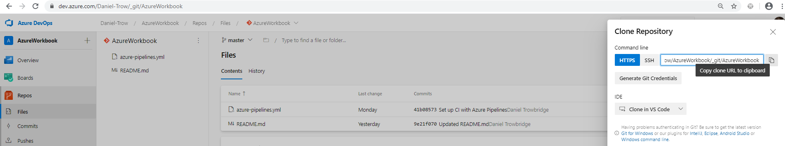


Create an AzureWorkbook component within UCD. It is important that this component be configured as follows:


  - **Name:** something like AzureWorkbookComponent
  - **Source Configuration Type:** Git
  - **Repository URL:** `https://dev.azure.com/<org name>/AzureWorkbook/_git/AzureWorkbook` (note: **If you copied this URL from Azure make sure to remove any user name portion "\<user name\>@"**)
  - **User name:** Copied from Azure git repo's generated credentials
  - **Password:** Copied from Azure git repo's generated credentials
  - Check **"Watch for Tags"**
  - Check **"Import Versions Automatically"**

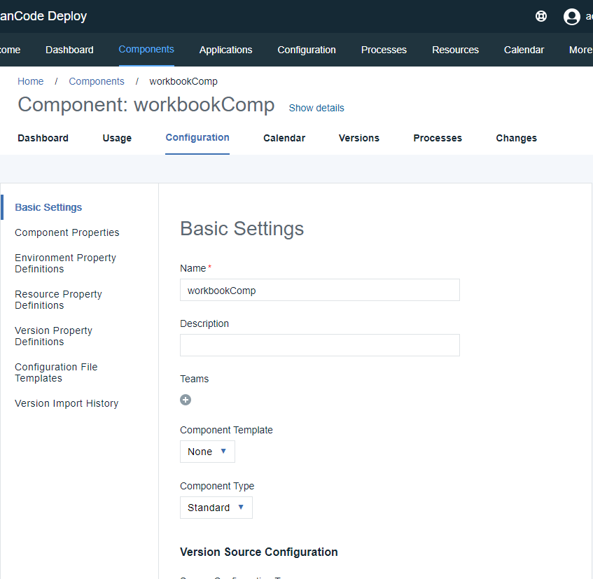

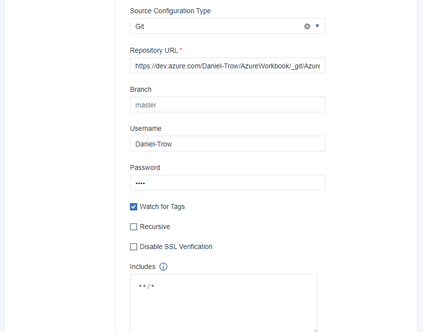

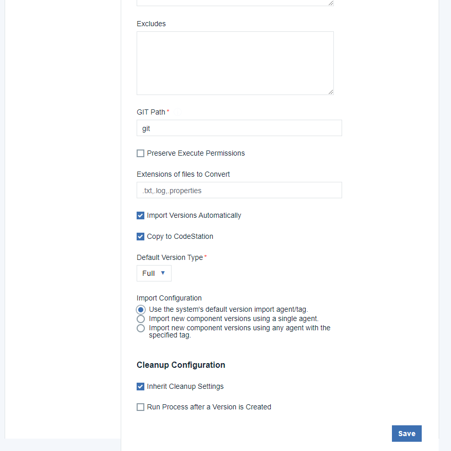

Confirm that the component version was imported from the Azure tag we created when we ran the Azure pipeline earlier.

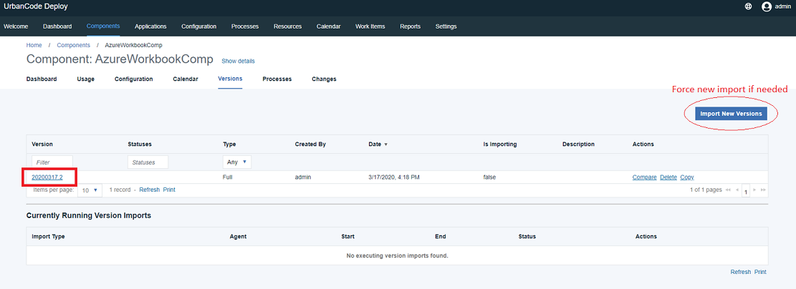

### 2.1.2 Create Component Process

We just need a bare minimum deploy process for this workbook. Make sure it is "Process Type" Deployment. The process itself will just be a one second wait (The wait step is available under utilities).

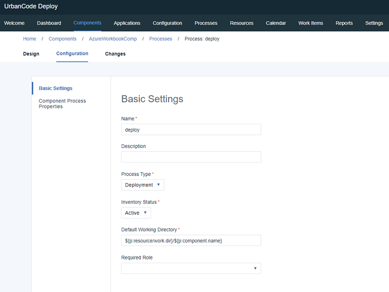

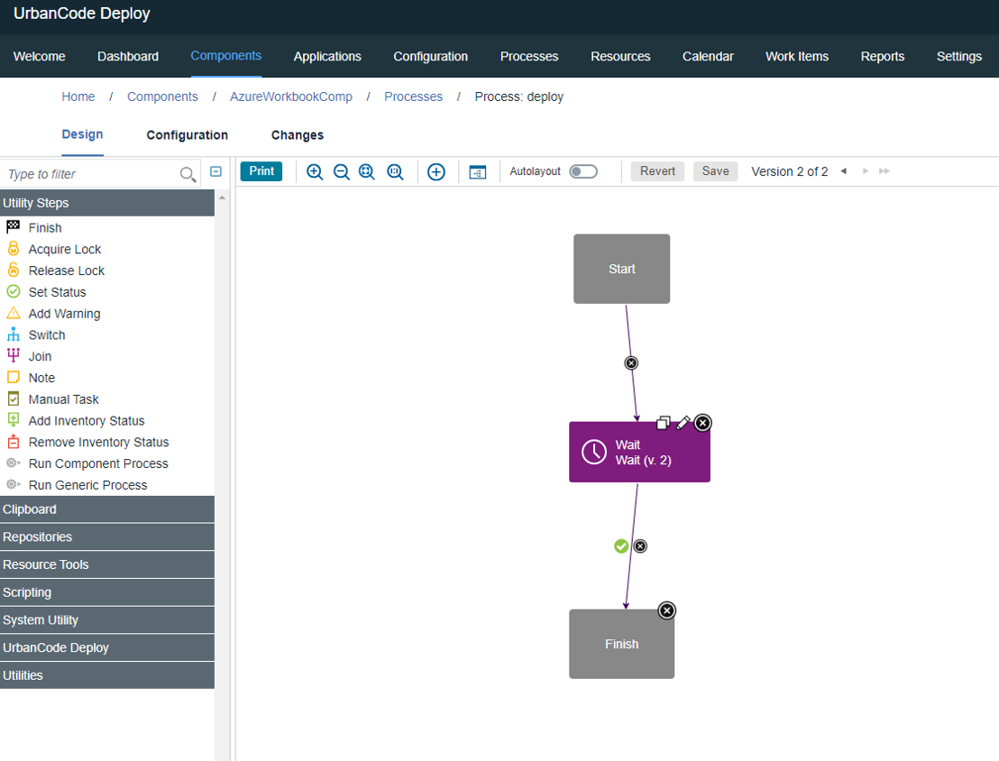


## 2.2 Create Workbook Application with Component

Create an application and name it "AzureWorkbook". **It is important that the UCD application name matches the Azure project name.** Make sure to add the workbook component to the application.

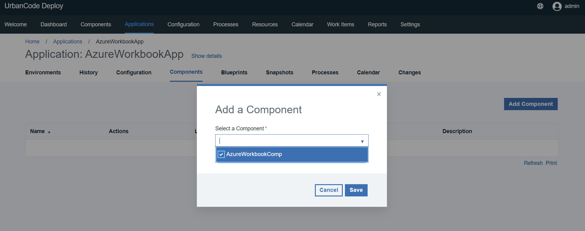

### 2.2.1 Create Application Process

Create a bare minimum install process for the application to install our component.

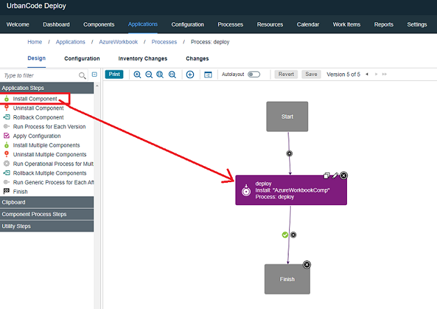

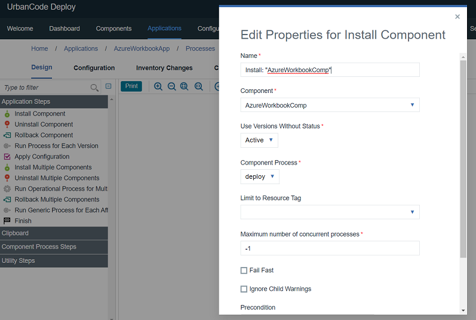

### 2.2.2 Create Environments

Create three environments named **"DEV", "QA", and "PROD"**. You can use the same base resource for each environment. Each should contain an agent with the workbook component we just created.

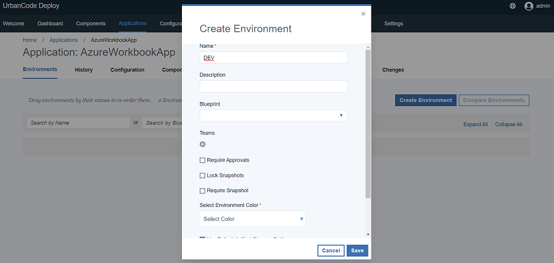

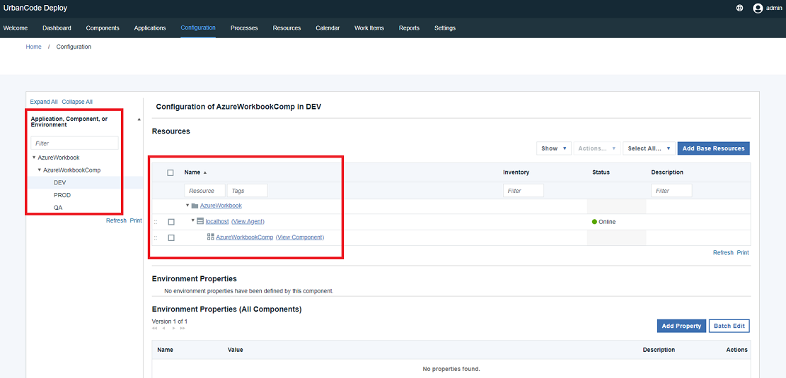

## 2.3 Create UCD Access Token

Navigate to `<UCD URL>/#security/tokens` ("Settings" --> "Tokens") and click **"Create Token"**. Make sure to copy and save token to use later.

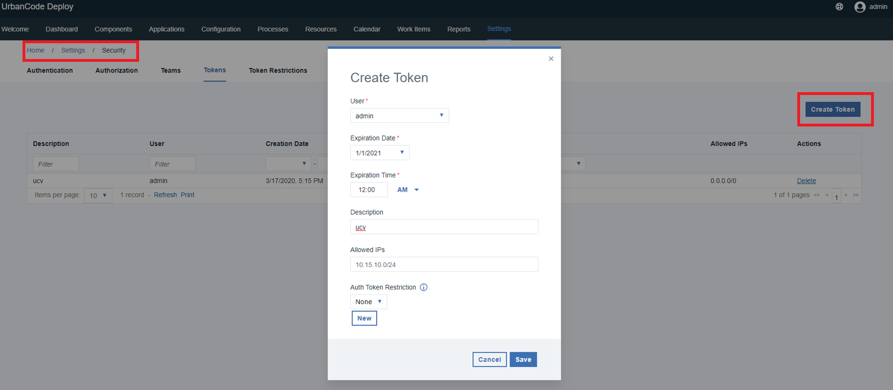


# 3. Setup Velocity

Requirements: 

1. Access to Velocity user with full permissions.


## 3.1 Create a Velocity User Access Key

Navigate to `<Velocity URL>/settings/myprofile` to create a user access key. Name the key so you can identify and delete it later if needed. **Make sure to copy the access key for future use.**


## 3.2 Setup UCD within Velocity

### 3.2.1 Create UCD Integration

Navigate to `<Velocity URL>/settings/integrations`. Click **"Plugins"** and click **"Add Integration"** for the **"UrbanCode Deploy"** plugin. Fill out the fields as shown below:

  - **Name:** something like "UcdWorkbook"
  - **UrbanCode Deploy Server URL:** Your UCD server URL
  > Note: Consider containerized networking. For instance, if Velocity is running from a Docker-Compose container and UCD is running at "localhost" then use "host.docker.internal" in place of "localhost".
  - **UrbanCode Deploy Access Token:** The UCD access token we previously created.

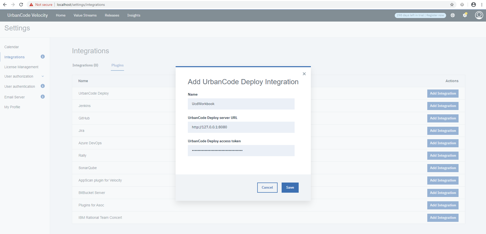

### 3.2.2 Allow Time for UCD to Sync

Before proceeding, it is important to **allow time for the UCD integration to sync**.

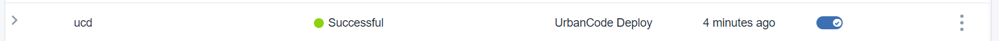

### 3.2.3 Add user to UCD Team

UCD teams are imported into Velocity. Make sure that your Velocity user has access to the UCD resources for this workbook.


## 3.3 Setup Azure within Velocity

### 3.3.1 Create Azure Integration

Navigate to `<Velocity URL>/settings/integrations`. Click "Plugins" and click "Add Integration" for the Azure plugin.


  - **Integration Name:** Use "AzureWorkbook" to match the vsm.json file that we'll use later.
  - **Loggin level:** "INFO"
  - **UrbanCode Velocity User Access Key:** Use the velocity user access key that we just created.


  - **URL:** The Azure URL: https://dev.azure.com
  - **Username:** What you use to login to Azure. Usually an email address.


  - **Password:** leave blank (using access token instead)
  - **Access Token:** Paste the Azure access token we created earlier.


  - **Organization:** You Azure organization name. Can be obtained and confirmed with your Azure home URL: `https://dev.azure.com/<your org name>`.
  - **Project:** Your Azure project name. Use "AzureWorkbook" for the workbook. This can be derived and confirmed against the project URL: `https://dev.azure.com/<your org name>/<project name>`
  - **Repositories:** You Azure repository (repo) name. Use "AzureWorkbook" for the workbook. This can be derived and confirmed against the repo URL: `https://dev.azure.com/<your org name>/_git/<repo name>`


Depending on your version of Velocity you might see an extra field for "Logger Level" at the button of the form. You can leave this blank.


### 3.3.2 Upgrade Azure Integration

**It is important to use the latest version of the Azure plugin for this workbook.** After creating the integration, click on the vertical ellipses on the right of the integration's row and click "upgrade" (if "upgrade" is not shown in the dropdown then the plugin is already updated to latest).

> A blue dot appears to the left of integrations whenever an upgrade is available.

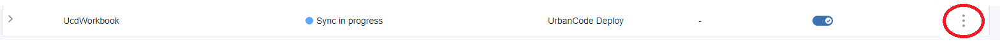

## 3.4 Create a Dummy Integration

Because of the way we are going to configure our value stream, this workbook requires a dummy integration. Add another integration from the integrations page by Clicking on "Plugins" and "Add Integration" for any plugin. Name the integration "dummyIntegration" (must match vsm.json configuration used later). The rest of the dummyIntegration's configuration does not matter so long as it gets created.

Go ahead and disable the dummyIntegration after creating it. Its status does not matter. **We should now have three integrations: "AzureWorkbook", "dummyIntegration", and our UCD integration.**

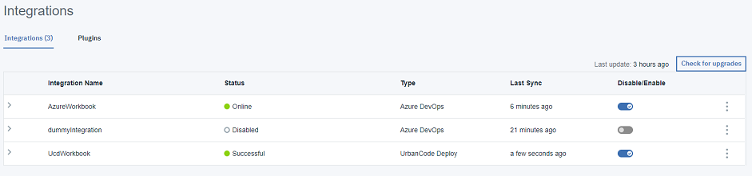


## 3.5 Create a New Value Stream

  1. Navigate to the *Value Streams* page and click "Create"   


  2. Name your value stream and select a team for it. The workbook uses the name **"Azure Workbook"** and **"Default Team"**. A value stream description is optional.

| Field | Description | Required | 
|-------|-------------|----------|
| Name | value stream name. | yes |
| Description | value stream description | no | 
| Team | Team of users who can access this value stream. | yes | 


### 3.5.1 Create a vsm.json file

UrbanCode Velocity value streams are fully configurable by downloading and uploading a value stream map (VSM) json file. Save the vsm.json content provided below as a .json file. We will then upload this file to configure our value stream.

> **Because this json content references integrations by name, the integrations must be created and named correctly before uploading it.**

```json
{
  "_id": "5e702311e1819863a523107a",
  "pipelineId": "83225f55-d456-4de1-af65-636eeb7916a9",
  "tenantId": "5ade13625558f2c6688d15ce",
  "description": null,
  "query": null,
  "phases": [
    {
      "name": "Planning",
      "description": null,
      "stages": [
        {
          "name": "Backlog-Demonstration",
          "query": "issue.status='New'",
          "description": null,
          "wipLimit": null,
          "gates": null
        }
      ]
    },
    {
      "name": "Development",
      "description": null,
      "stages": [
        {
          "name": "In Progress",
          "query": "(issue.status=\"Active\" and pr.status!=\"active\" and pr.status!=\"completed\")",
          "description": null,
          "wipLimit": null,
          "gates": null
        },
        {
          "name": "In Review",
          "query": "pr.status=active and issue.status!=\"Closed\"",
          "description": null,
          "wipLimit": null,
          "gates": null
        }
      ]
    },
    {
      "name": "Build",
      "description": null,
      "stages": [
        {
          "name": "Merged",
          "query": "pr.status = 'completed' and deployment.env != 'DEV' and deployment.env != 'QA' and deployment.env != 'PROD'",
          "description": null,
          "wipLimit": null,
          "gates": null
        }
      ]
    },
    {
      "name": "Deploy",
      "description": null,
      "stages": [
        {
          "name": "DEV",
          "query": "deployment.env = 'DEV' and deployment.env != 'QA' and deployment.env != 'PROD' and pr.status = 'completed'",
          "description": null,
          "wipLimit": null,
          "gates": null
        },
        {
          "name": "QA",
          "query": "deployment.env = 'QA' and deployment.env != 'PROD' and pr.status = 'completed'",
          "description": null,
          "wipLimit": null,
          "gates": null
        },
        {
          "name": "PROD",
          "query": "deployment.env = 'PROD' and pr.status = 'completed'",
          "description": null,
          "wipLimit": null,
          "gates": null
        }
      ]
    }
  ],
  "leadTime": null,
  "cycleTime": null,
  "mappings": null,
  "integrations": [
    {
      "name": "AzureWorkbook"
    },
    {
      "name": "dummyIntegration"
    }
  ],
  "linkRules": [
    {
      "fromIntegrationName": "AzureWorkbook",
      "toIntegrationName": "AzureWorkbook",
      "fromField": "pr.name",
      "toField": "issue.id",
      "pattern": "([0-9]+)"
    }
  ],
  "metrics": null,
  "metricsBar": null
}
```

> **_Explanation of VSM JSON_**
> - **Integrations Array**   
> This vsm.json content defines an integration for Jira. Integrations are included based on integration name. This workbook uses the names **"AzureWorkbook"** and **"dummyIntegration"**. This part of the vsm.json needs changed if the integrations happen to be named differently.
>```json
>"integrations":[
>    {
>      "name":"AzureWorkbook"
>    },
>    {
>      "name":"dummyIntegration"
>    }
>]
> ```
>    
>    
> - **Phases and Stages**  
> Value streams are organized as phases and stages. The json file provides phase and stage definitions. An important part of stages are stage queries which logically define whether a work item (dot) should be included in a stage or not.
> ```javascript
>"phases": [
>  {
>    "name": "Planning",
>    "description": null,
>    "stages": [
>      {
>        "name": "Backlog-Demonstration",
>        "query": "issue.status='New'",
>        "description": null,
>        "wipLimit": null,
>        "gates": null
>      }
>    ]
>  }
>]
>```
> 
>
>
>  - **Link Rules**
>  Link rules are important for this workbook. They define how pull requests (PRs) get linked to work items. In this case based on the regex pattern `([0-9]+)`.
>
>
>```javascript
>  "linkRules": [
>    {
>      "fromIntegrationName": "AzureWorkbook",
>      "toIntegrationName": "AzureWorkbook",
>      "fromField": "pr.name",
>      "toField": "issue.id",
>      "pattern": "([0-9]+)"
>    }
>  ]
>```
>


### 3.5.2 Upload the vsm.json File

If you have a brand-new value stream, then the upload button will be directly available.


After the first vsm.json file is uploaded, the value stream can be modified with additional uploads via the tools and utilities dropdown option "Replace value stream map". 


After uploading the vsm.json file you should see the appropriate phases and stages in your value stream:


## 3.6 Configure the Value Stream Pipeline

### 3.6.1 Add UCD to the Pipeline

On the Value Stream page, click **"Pipeline"** and click **"Add App"**, then  choose **"UrbanCode Deploy"** from the dropdown. You will also need to select the application and process for this workbook.

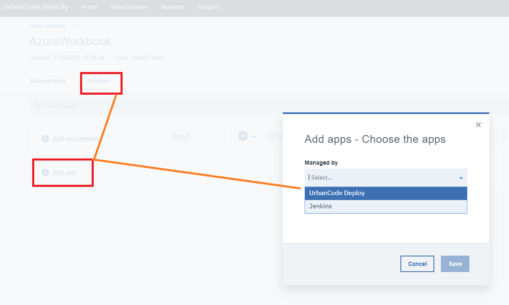

### 3.6.2 Map Environments

Click on the "+" icon under each environment to map a UCD environment to the Velocity pipeline environment.

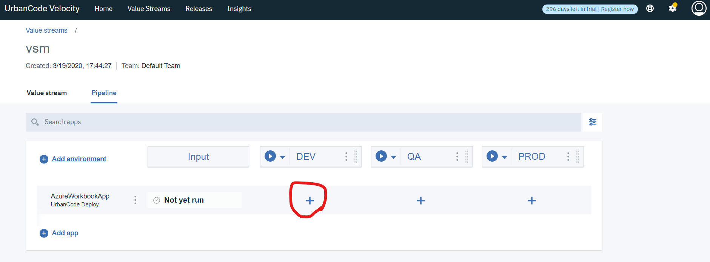


# 4. Use the Value Stream from Planning to Merged

Shew, that was a lot of setup. Now let's get that dot moving!

> **Explore**: Each step shows a value stream screenshot of the dot in a stage, but don't let your exploration stop there! As you go through this workbook take a look around. The "Swim Lanes" view is automatically configured as part of the value stream. It provides an assigned user view all the way from backlog to PROD. Poke around more and you'll find that Insights is already at work gathering data like build and deployment counts as we proceed.
> 
> 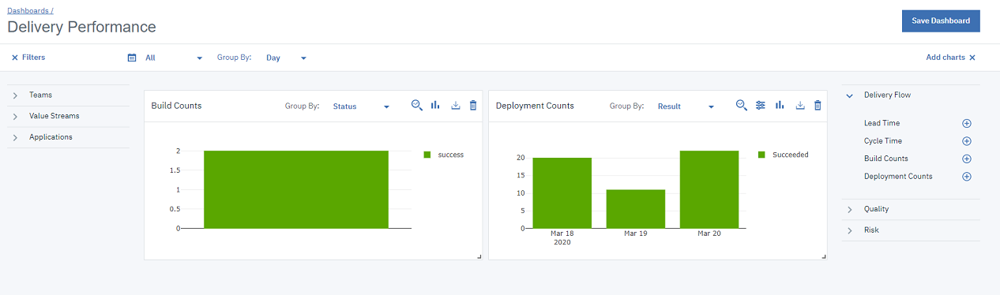


---

> **Pro Tip**: We're about to do a lot of external activity to Velocity. To speed things up, you can force Velocity integrations to sync by clicking disable/enable every time we change an external state (like create a work item or merge a PR)
>
> 


## 4.1 Backlog

As observed above, our value stream has a bunch of stages but no dots, that's perfectly accurate for our empty board in Azure. Click on "New Item" to create a new work item.


You can title this work item anything you like, the example below names it "do the workbook" and assigns it a work item ID of "5". **Take note of this work item ID. It will probably be a different number for you and you will need it later.**


Once Velocity syncs up with Azure (disable/enable integration if you don't want to wait) you will see the dot show up in your backlog. Neat!


but why is it red, it seems a little upset 😡?... Aww, because it has an alert: "Issue not assigned".


Go ahead and assign it to someone back in Azure. There's nothing like a little delegating to get the ball rolling (even if it is to yourself).


Now our dot is a happy little dot 😇 (and we see the beginnings of its history)


## 4.2 In Progress

Turns out, we are in fact doing the workbook :) so grab that "do the workbook" card from the backlog and move it to "active".


Wait for Velocity to sync (or force with disable/enable). The dot will move to "In Progress".


## 4.3 In Review

Now that the card is active, we have to do some actual work to move the dot to review. That's a good thing; Velocity is a lot more than just moving cards around!

### 4.3.1 Create a new Branch

Navigate to branches in Azure and click "New branch". 
The branch name does not matter; you can just name it "workbook" and Click create.


### 4.3.2 Make Changes to the Branch


Once the branch is created we can directly edit the `README.md` file from Azure. You can make any changes you want, like change the "Introduction" section to say "workbook". 


### 4.3.3 Commit Changes

Once you've made changes click "Commit".


### 4.3.4 Create Pull Request

After committing changes our branch is now different than master. That's great, we've added value! Click "Create a Pull Request".


For the most part, the default values are fine for the Pull Request (PR), except one critical piece: **we need the work item ID to be in the PR title**. This is because we configured our value stream back in Velocity to link work items to PRs based on the work item ID in the PR title. The example here shows "5" but your ID is probably different. Once correctly titled, click "Create" to create the PR.


### 4.3.5 Observe Dot

Wait for Velocity to sync (or disable/enable integration). The dot will move from "In Progress" to "In Review".


## 4.4 Merged

You have reviewed your changes and lo, they are beyond perfect, even sublime. Your PR is approved, go ahead and merge (click "Complete").


The default values for "Complete pull request" are fine, click "Complete merge".


Wait for Velocity to sync. The dot will move to "Merged".


# 5. Use the Value Stream with Deployments

## 5.1 Create a UCD snapshot

In UCD, for the workbook application, click on the play icon on the left of the DEV environment to request a process.

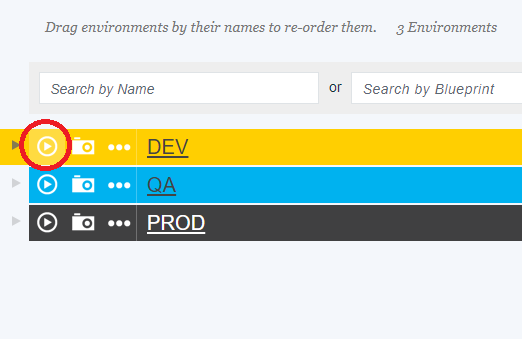

We will run our "deploy" process that installs our component. We need to choose a component version though; click "Choose Versions".

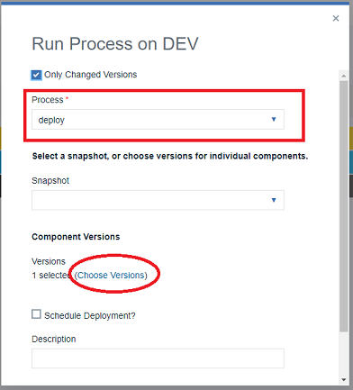

We should be fine with choosing "Latest Available" for our version. This should give us the version we synced over to UCD from our Azure git tag created by our Azure pipeline.

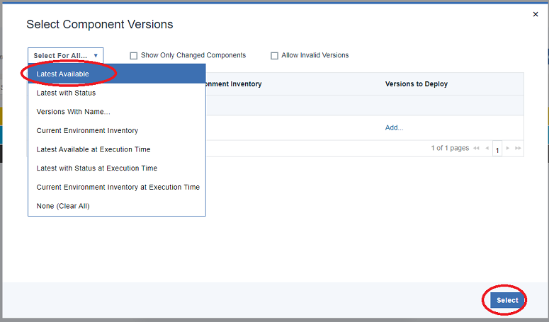

The process should run and deploy the component. Click the camera icon for DEV to take a snapshot of the deployment. **Name the snapshot the same as the version.**

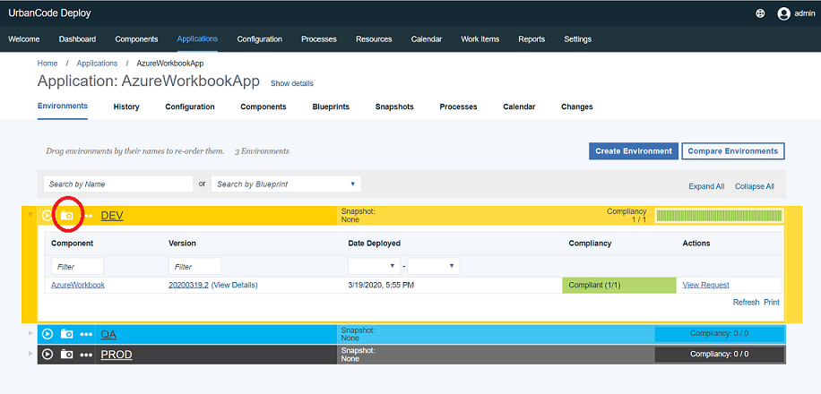

## 5.2 Deploy to Dev

From UCD, click the play icon again except this time let's use our snapshot for the deployment. Then go back to Velocity and give it time to sync. The dot will move to the deployment stage for DEV.


## 5.3 Deploy to QA

From Velocity, go to our pipeline. Click the play icon for QA. Give it time to run and sync, then navigate back to the value stream and observe the dot in QA.

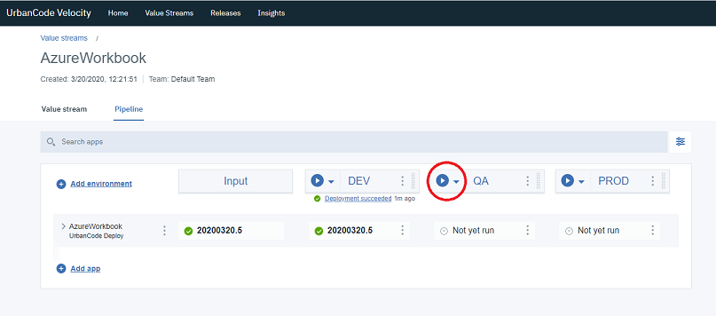

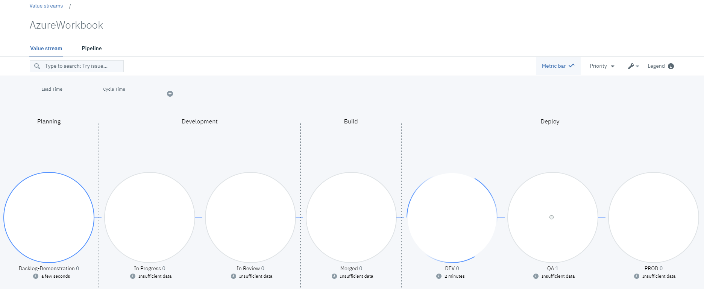

## 5.4 Deploy to Prod

Finally, you can choose either between UCD or the Velocity pipeline to deploy the snapshot to PROD. Wait for Velocity to sync and the dot will move to PROD. We have completed the value stream at this point from planning to production. 👏

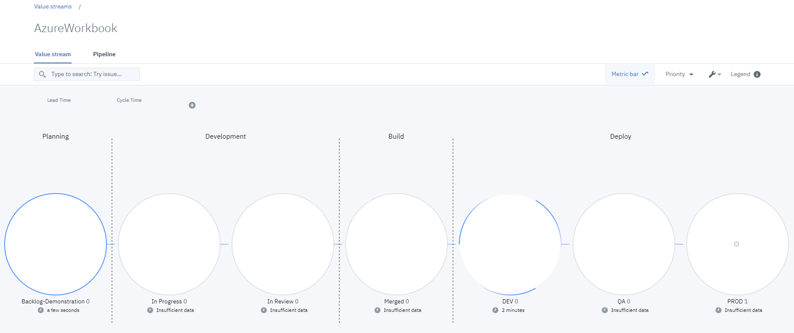
