# Introduction to Value Streams

### Objective
Create a value stream with Jira, Github, and Jenkins integrations and exercise it from beginning (a new issue in Backlog) to end (deployment to Prod).


### Summary
We will start with the planning phase of our pipeline by focussing on Jira. We will need an instance of Jira to setup a Jira board and create a Jira card. We will create a Jira integration within Velocity and create a new value stream to work with this integration. We will finish the Jira section by seeing how changes to Jira cards are captured by an UrbanCode Velocity value stream.

As the issue transitions from the planning phase to the development phase we will focus on GitHub. We will need an instance of GitHub with a repository and pull request (PR). We will create a GitHub integration within Velocity and add this integration to a value stream. We will then observe work item progress all the way to "Merged" based on GitHub activity.

Lastly, we will turn our attention to the final phase of deployment. We will need a Jenkins instance for this equipped with an UrbanCode Velocity plugin. We will create a Jenkins integration within Velocity and define an application within our value streams pipeline. We will use jenkins jobs to build and deploy this application and observe the value stream as the work items continue on through build and deployments all the way to our production environment.

<i style="color:rgb(130,130,130)">Questions or suggestions? Create an issue at 
<a href="https://github.com/urbancode/velocity-info/issues">https://github.com/urbancode/velocity-info/issues</a>
</i>

---

**Table of Contents**
- [Introduction to Value Streams](#introduction-to-value-streams)
    - [Objective](#objective)
    - [Summary](#summary)
- [1. Creating a New Value Stream](#1-creating-a-new-value-stream)
- [2. Working with Jira](#2-working-with-jira)
  - [2.1 Setting Up Jira](#21-setting-up-jira)
  - [2.2 Creating a Jira integration](#22-creating-a-jira-integration)
  - [2.3 Adding a Jira Integration to a Value Stream](#23-adding-a-jira-integration-to-a-value-stream)
    - [2.3.1 Create a vsm.json file](#231-create-a-vsmjson-file)
    - [2.3.2 Upload the vsm.json file.](#232-upload-the-vsmjson-file)
    - [2.3.3 Confirm that integration is working](#233-confirm-that-integration-is-working)
  - [2.4 Stage Changes with Jira](#24-stage-changes-with-jira)
- [Recap: Planning to Development, from Jira to GitHub](#recap-planning-to-development-from-jira-to-github)
- [3. Working with GitHub](#3-working-with-github)
  - [3.1 Setting up a GitHub repository and Pull Request](#31-setting-up-a-github-repository-and-pull-request)
  - [3.2 Creating a GitHub integration](#32-creating-a-github-integration)
  - [3.3 Adding the GitHub Integration to a value stream](#33-adding-the-github-integration-to-a-value-stream)
  - [3.4 Stage changes using Jira and GitHub](#34-stage-changes-using-jira-and-github)
- [Recap: From Development to Build servers and Beyond](#recap-from-development-to-build-servers-and-beyond)
- [4. Working with Jenkins](#4-working-with-jenkins)
  - [4.1 Setting up Jenkins](#41-setting-up-jenkins)
  - [4.2 Creating a Jenkins Integration](#42-creating-a-jenkins-integration)
  - [4.3 Adding a Jenkins Integration to a Value Stream](#43-adding-a-jenkins-integration-to-a-value-stream)
    - [4.4 Downloading API Attributes from Velocity](#44-downloading-api-attributes-from-velocity)
  - [4.5 Stage Changes with Jenkins](#45-stage-changes-with-jenkins)
    - [4.5.1 Build and Deployment to DEV and QA](#451-build-and-deployment-to-dev-and-qa)
    - [4.5.2 Deploying to Prod](#452-deploying-to-prod)
      - [4.5.2.1 Create another Jenkins Job for Deployment to Prod](#4521-create-another-jenkins-job-for-deployment-to-prod)
      - [4.5.2.2 Setting up a Pipeline to Deploy to Prod](#4522-setting-up-a-pipeline-to-deploy-to-prod)
      - [4.5.2.3 Final Stage Change to PROD](#4523-final-stage-change-to-prod)
- [5. Conclusion](#5-conclusion)

---


# 1. Creating a New Value Stream

Our first order of business is to create the value stream. All we want to do is create the value stream right now. We will come back to configure it after setting up Jira.

  1. Navigate to the *Value Streams* page and click "Create"   

  1. Name your value stream and select a team for it. The workbook uses the name **"JKE App1"** and **"Default Team"**. A value stream description is optional.   
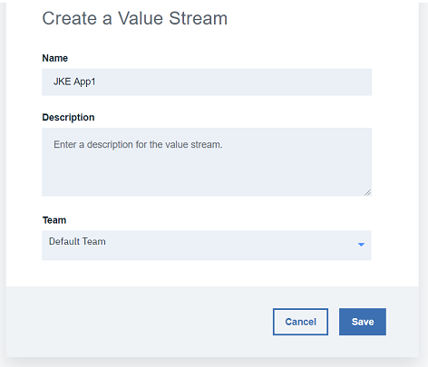


| Field | Description | Required | 
|-------|-------------|----------|
| Name | value stream name. | yes |
| Description | value stream description | no | 
| Team | Team of users who can access this value stream. | yes | 

# 2. Working with Jira 

## 2.1 Setting Up Jira

- **Jira instance**

  This workbook requires a Jira instance that can be accessed and authenticated against using an API Token.

  If you do not have a Jira instance readily available for this purpose, one option is to use a cloud Jira instance from https://www.atlassian.com.

  

  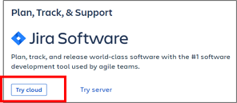

- **Jira Board**

  The Jira board should have the five columns and status names listed below:

  1. Backlog
  2. Selected for Development
  3. In Progress
  4. In Review
  5. Merged

  

- **Jira Issue**
  The workbook begins with a single issue in the "backlog" column.

  


## 2.2 Creating a Jira integration

See also [Jira plugin Documentation](https://www.urbancode.com/plugindoc/jira-4/) at https://www.urbancode.com

1. Navigate to the UrbanCode Velocity plugins page (Settings>Integrations>Plugins) and click "Add Integration" for the Jira plugin. You will be prompted to fill out the "Add Jira Integration" form.


1. Provide an integration name. The name used for the workbook is "JKE Jira 1".  

1. Provide the Jira base URL. This depends on your instance of Jira. For cloud Jira it will be of the form "https://**\<custom-part-of-url\>**.atlassian.net". 

4. Provide the Jira username. This should be the email address used for your Jira login. 

5. Provide authentication (API Token or oAuth). This workbook uses an API Token from cloud Jira, which can be created at https://id.atlassian.com/manage/api-tokens. Create a token and provide it as the "Password" in Velocity (a regular account login password will not work in this case).    

6. As stated above, since we are using an API Token for this workbook, we will leave the four oAuth fields blank.    

7. The last field defines the Jira projects of interest. Use the Jira project code, not the full name.   


8. After clicking on "Save" the integration should be created and visible on the integrations page.  


## 2.3 Adding a Jira Integration to a Value Stream

### 2.3.1 Create a vsm.json file

Now that the integration has been added to Velocity, it can also be added to a specific value stream. UrbanCode Velocity value streams are fully configurable by downloading and uploading a value stream map (VSM) which is a specially crafted .json file. Save the vsm.json content provided below as a .json file. We wil then upload this file to configure our value stream.

> **Because this json content references your Jira integration by name, the integration must be named "JKE Jira 1" and must be "online" before uploading it.**

<!-- **Workbook vsm.json content - Save this json content to a file and upload to your value stream.** -->

<figure class="video_container">
<iframe src="https://docs.google.com/document/d/e/2PACX-1vSCaI_BIICRQYIN4vCynEcHwepabvJWsrUPusmFFbEFGpfpC0g9Nob0IFyoUh1db7otKzitZptFtwNW/pub?embedded=true"></iframe>
</figure>

```json
{
  "tenantId": "5ade13625558f2c6688d15ce",
  "integrations": [
    {
      "name":"JKE Jira 1"
    }
  ],
  "phases": [
    {
      "name": "Planning",
      "stages": [
        {
          "name": "Backlog",
          "query": "issue.status=Backlog"
        },
        {
          "name": "Selected For Development",
          "query": "issue.status='Selected for Development' AND (pr.status!=open AND pr.status!=closed)"
        }
      ]
    },
    {
      "name": "Development",
      "stages": [
        {
          "name": "In Progress",
          "query": "(issue.status='In Progress' OR pr.status=open) AND issue.status!='In Review'"
        },
        {
          "name": "In Review",
          "query": "issue.status='In Review' AND pr.status=open"
        },
        {
          "name": "Merged",
          "query": "issue.status=Merged OR pr.status=closed AND build.status!=success"
        },
        {
          "name": "Build",
          "query": "build.status=success AND deployment.env!=DEV"
        }
      ]
    },
    {
      "name": "Deployment",
      "stages": [
        {
          "name": "DEV",
          "query": "deployment.env=DEV AND deployment.env!=QA"
        },
        {
          "name": "QA",
          "query": "deployment.env=QA AND deployment.env!=PROD"
        },
        {
          "name": "PROD",
          "query": "deployment.env=PROD"
        }
      ]
    }
  ]
}
```

> **_Explanation of VSM JSON_**
> - **Integrations Array**   
> This vsm.json content defines an integration for Jira. Integrations are included based on integration name. This workbook uses the name **"JKE Jira 1"**. This needs  changed if the integration happens to have been named differently.
>```json
>"integrations":[
>    {
>      "name":"JKE Jira 1"
>    }
>]
> ```
>    
>    
> - **Phases and Stages**  
> Value streams are organized as phases and stages. The json file below provides phase and stage definitions for this workbook. An important part of stages are stage queries which logically define whether a work item (dot) should be included in a stage or not.
> ```javascript
>"phases":[
>  {
>    "name": "Planning",
>    "stages": [
>      {
>        "name": "Backlog",
>        "query": "issue.status=Backlog"
>      },
>      ...
>```
> 
>

### 2.3.2 Upload the vsm.json file.
If you have a brand-new value stream, then the upload button will be directly available.


After the first vsm.json file is uploaded, the value stream can be modified with additional uploads via the tools and utilities dropdown option "Replace value stream map". 


### 2.3.3 Confirm that integration is working
  Wait for Velocity to synchronize data. The Jira issue that was placed in the Backlog should now appear in the value stream Backlog.


## 2.4 Stage Changes with Jira

After setting up the Jira integration in Velocity and using the vsm.json file to add the integration and stage queries to the value stream, the Jira card should be visible as a dot within the value stream. The issue status can be updated in Jira and the work item (dot) will change stages in Velocity.

1. Move the Jira card from "Backlog" to "Selected for Development".    
   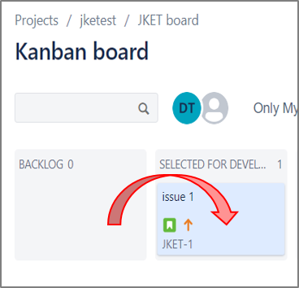

2. Allow time for Velocity to synchronize (usually ~1 minute max). The work item should moved to next stage "Selected For Development".       
    

3. Click on the dot to view details such as a link back to the Jira card as well as work item history.       
   

# Recap: Planning to Development, from Jira to GitHub

This section has focussed on the planning phase of our value stream. In this case, we used Jira as our issue tracker. We created a Jira board and issue, setup a Jira integration, added that integration to a value stream, and observed how the value stream tracked Jira status changes throughout the planning phase. In theory, we could use Jira for every stage of our value stream; however, in practice, Jira cards are encumbered by manual updates and ulterior constraints. We can do  better than that! We can directly integrate with our other systems like GitHub and Jenkins to gain a real-time, fully automated, and accurate visualization of our work item's journey. Next up is our development phase where we will add a GitHub integration and see how Jira and GitHub can work in tandem.

<i style="color:rgb(130,130,130)">Questions or suggestions? Create an issue at 
<a href="https://github.com/urbancode/velocity-info/issues">https://github.com/urbancode/velocity-info/issues</a>
</i>

# 3. Working with GitHub

## 3.1 Setting up a GitHub repository and Pull Request

**GitHub requirements:**
- Access to a GitHub repository *(this workbook assumes a public repository)*
- GitHub API token
- A pull request (PR) that references the Jira issue in its name.

A very easy option is to use a public GitHub account and public repository. The repository contents do not matter, but a PR is required and must contain the issue ID of the Jira issue we are following in the PR name (the example here is "JKET-1"). The steps below are for creating a new PR.

1. Edit any file in the repository. This example just edits a README file that can be edited by clicking on the pencil icon to the upper right of the file.   
    

2. Make changes to the file. Think of these changes as corresponding to the Jira card created earlier. This represents the code changes for that card.   
    

3. Commit the changes to a separate branch.   
    

4. When prompted to create a pull request, **provide the Jira code in the pull request name** (ex. "JKET-1"), then click "Create pull request".                         
    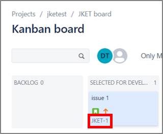
    

5. Confirm that the pull request is open and contains the Jira issue ID.
    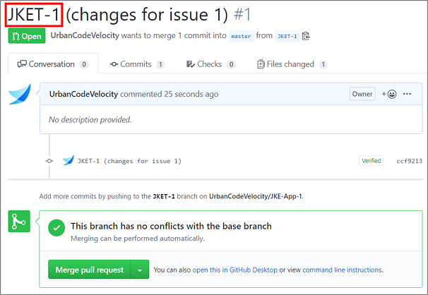

## 3.2 Creating a GitHub integration

1. The integration can be added from the plugins page in Velocity (Setting->Integrations->Plugins).   
    
1. The integration name for this workbook should be "JKE GitHub App1".   
    
2. The GitHub URL should be the URL to the repository.  
    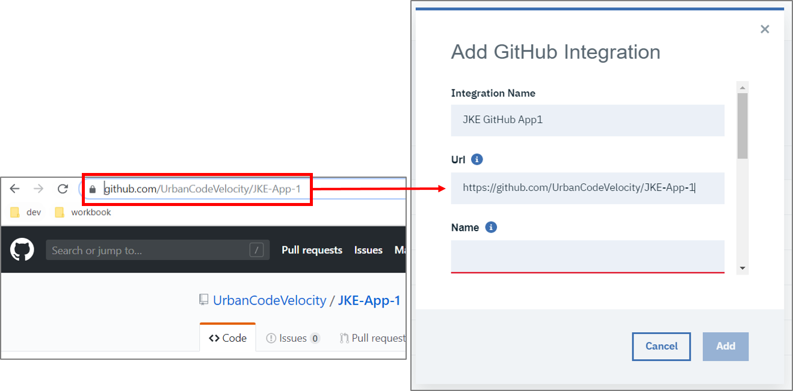
3. The "Name" and "Owner" fields are also for the GitHub repository and can be found in the GitHub repository URL.    
    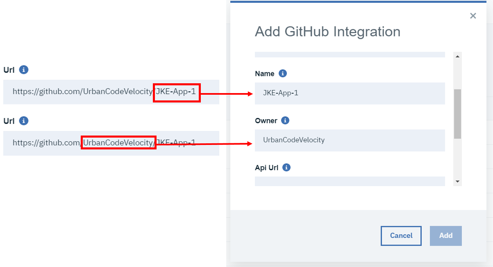
4. The API URL depends on your instance of GitHub. This workbook assumes a public instance of GitHub which uses "https://api.github.com".   
    
5. Create a GitHub personal access token for an account with access to the repository, then provide that token to Velocity. Public GitHub tokens can be created at [https://github.com/settings/tokens](https://github.com/settings/tokens). There is no need to select checkboxes for scoping/privileges when creating the token.   
    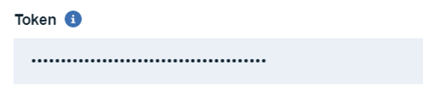

## 3.3 Adding the GitHub Integration to a value stream

Use the vsm.json file to add the GitHub integration and a linkRule to the value stream. Download the file and then modify it by adding the following sections, then upload the file again to apply changes. The work item (dot) should move to the "In Progress" stage since the PR is open.

1. Download the working vsm.json file from the value stream. 
    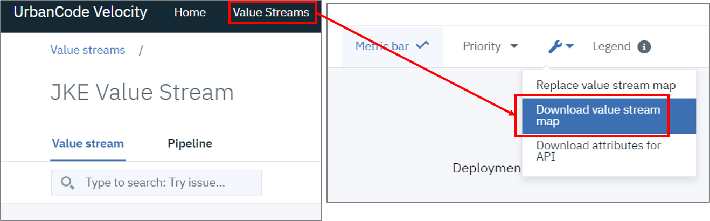
2. Add the GitHub integration to the .json content.

    Similar to the json that added the Jira integration, we will need to add another json object to the integrations array. The name used here must match the GitHub integration name created earlier. Note that the sample code below shows the "JKE Jira 1" object as only having the name property but a downloaded vsm.json will contain additional details for this object. We only need to add the GitHub object with its single name property for now and can ignore the details for the Jira object.

    ```json
      "integrations": [
        {
          "name":"JKE Jira 1"
        },
        {
          "name":"JKE GitHub App1"
        }
      ],
    ```

1. Add the linkRules to the .json content.

    replace the empty link rules array...

    ```json
    "linkRules": [],
    ```
    with an array that contains a new link rule object. This linkRule links GitHub PRs to Jira issues based on a regex pattern that recognizes a jira.id within a pr.name.

    ```json
      "linkRules": [
        {
          "fromIntegrationName": "JKE GitHub App1",
          "toIntegrationName": "JKE Jira 1",
          "fromField": "pr.name",
          "toField": "issue.id",
          "pattern": "([A-Z]+-[0-9]+)"
        }
      ],
    ```

2. Save and upload the vsm.json file. 
    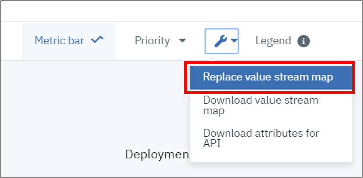
1. After waiting for Velocity to detect and update, the dot should appear in the "In Progress" stage.  
   


<!--
This content was temporarily commented out to simplify workbook flow

In this case, the stage query defined in the vsm.json allows one dot to lag behind based on Jira status, while the other dot moves ahead based on PR status. Both dots represent the same issue though, and are selected together. 
   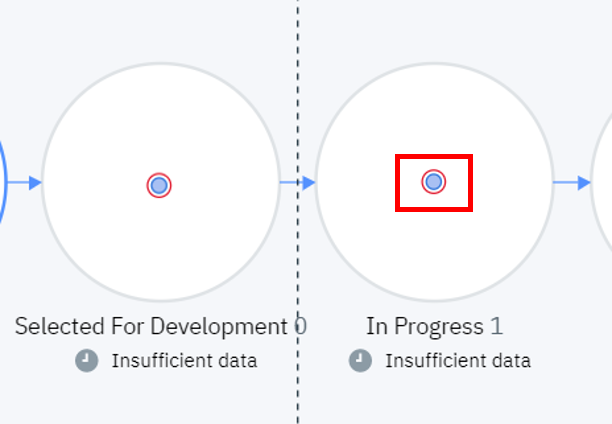
1. We can see from the Value Stream that the Jira card is now out-of-date and should be moved to "In Progress". In Jira, move the card from "Selected for Development" to "In Progress". Give enough time for Velocity to detect the change and update. The Jira status and PR state are now in agreement and should be a single dot inside the "In Progress" stage.
   
-->


## 3.4 Stage changes using Jira and GitHub

1. Update the Jira card to "In Review".  
   
2. Wait for Velocity to update. The dot should move from "In Progress" to "In Review".  
   
3. Go ahead and merge the PR in GitHub.   
   
4. Wait for Velocity to update. The dot should move from "In Review" to "Merged".   
  


<!--
This content was temporarily commented out to simplify workbook flow

The stage queries for this workbook allow Jira statuses to disagree with GitHub PRs and the dot to appear in different stages. This is configurable, but for the purpose of the workbook it highlights how Jira is a manual step that lags behind other process changes. This sections moves the dot from "In Progress" to "Merged" while keeping GitHub and Jira synchronized. You can also experiment with this section by allowing Jira to become outdated or ahead and observe how the value stream captures disagreement between systems.

1. This workbook uses a label "PendingReview" to indicate that a review is in progress. Add this label to the GitHub PR.  
   
2. If you pause at this point, one dot will move forward to the "In Review" stage but another will lag behind because the Jira card has not been updated (the dots still represent the same work item though). Go ahead and update the Jira card so that a single dot moves forward. This indicates that all systems are in agreement.  
   
3. A single dot moves from "In Progress" to "In Review".  
   
4. The next stage is "Merged". Go ahead and merge the PR.  
   
5. Like before, if we pause at this point the Jira card will cause a dot to stay behind. Go ahead and update the Jira card to "Merged".  
   
6. A single dot moves from "In Review" to "Merged".  
    -->


# Recap: From Development to Build servers and Beyond

So far we have already gained value by observing our value stream across Jira and GitHub. Next we will see how Jenkins can integrate with UrbanCode Velocity's pipeline and value stream forming a powerful combination of build and deployment control and tracking.

<i style="color:rgb(130,130,130)">Questions or suggestions? Create an issue at 
<a href="https://github.com/urbancode/velocity-info/issues">https://github.com/urbancode/velocity-info/issues</a>
</i>

# 4. Working with Jenkins

## 4.1 Setting up Jenkins

If you do not have a Jenkins server available, See Jenkins documentation for running a local instance [https://jenkins.io/doc/book/installing/](https://jenkins.io/doc/book/installing/).

This example uses the pipeline plugin for Jenkins. If you have not already, add this plugin now: [https://plugins.jenkins.io/workflow-aggregator](https://plugins.jenkins.io/workflow-aggregator).

## 4.2 Creating a Jenkins Integration

UrbanCode Velocity value streams can include build and deployment data from Jenkins. Due to the nature of Jenkins being a build server, the setup for it is slightly different than the other plugins discussed in this workbook. For one, because Velocity has the ability to start Jenkins jobs, it requires a plugin on the Jenkins server as well. Also worth noting for when we go to use our integration with value streams is that, because Jenkins is incorporated at the deployment plan and pipeline level of Velocity, it is not added to value streams via the vsm.json.

1. Install the UrbanCode Velocity plugin on your Jenkins instance.
   Navigate to the plugins page on your Jenkins instance by clicking `Manage Jenkins > Manage Plugins > Available (tab)` and search for `UrbanCode Velocity Plugin`.  When located install the plugin and restart your instance when possible.

2. Navigate to the Settings Page of UrbanCode Velocity and select the Integrations section in the left navigation, then click on "Plugins". Create a new Jenkins integration by clicking "Add Integration".  
   

3. Provide a name for your Jenkins integration (should describe the jenkins instance). You can name this integration anything for the workbook.   
   

4. Click "Create". This will generate an **Integration ID** and **Integration Token** pair. Click "Copy to Clipboard" to copy these fields and save them. These values will be needed to configure the UrbanCode Velocity plugin installed on Jenkins.

5. Back in Jenkins, navigate to the Jenkins configuration page `Manage Jenkins > Configure System > UrbanCode Velocity (section)`.  Under the UrbanCode Velocity section paste the **Integration ID** and **Integration Token** values generated by the integration we created in Velocity.

6. Also in Jenkins, Provide credentials for a Jenkins user on whose behalf this plugin may access your Jenkins items.

7. Depending on your version, you might need to provide a Velocity user access token to the Velocity plugin for Jenkins (the access token field is not shown in the screenshot below). This access token is created within Velocity and should be used uniquely by this Jenkins integration as its own authentication.

8. Click `Apply` and `save` before clicking the `Test Connection` button to confirm your connection to UrbanCode Velocity. Upon successful connection, your data will be posted to UrbanCode Velocity.   
   

## 4.3 Adding a Jenkins Integration to a Value Stream

Jenkins integrations and jobs are made available to the value stream in a different way than other integrations. There is no need to edit the vsm.json file; however, we will need to create an "Application" on the value stream's pipeline in order to have a target for build and deployment data.


1. Navigate to "Pipeline" and click "Add app".  

2. Select "Jenkins" from the dropdown.  

3. Type an application name. The workbook uses the name "JKE App1".  

4. The new application should appear as a row within the pipeline.  


### 4.4 Downloading API Attributes from Velocity

Jenkins publishes data to Velocity using API attributes to identify constructs such as pipelines and applications. We will need these attributes as we configure our Jenkins jobs. You can download API Attributes directly from the value stream under the tools and utilities dropdown > "Download attributes for API".

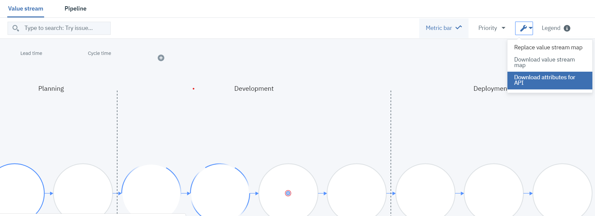

## 4.5 Stage Changes with Jenkins

### 4.5.1 Build and Deployment to DEV and QA

1. Create a new Jenkins Pipeline Job.    
    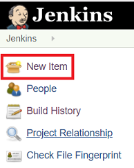  
    

2. Copy and paste the script below as a pipeline script. You will need to provide four variables to the script, which are summarized in the table below.

**Variable Name**|**Description**|**Example**
-----|-----|-----
GITHUB\_REPO\_URL|The URL to your GitHub repository that you are using for this workbook.|https://github.com/UrbanCodeVelocity/JKE-App-1
VELOCITY\_ENV\_ID\_DEV|An ID that uniquely identifies your value stream's DEV environment|cb348f56-29f3-4ade-9c9f-38daedf3b663
VELOCITY\_ENV\_ID\_QA|An ID that uniquely identifies your value stream's QA environment|7a115f90-f4e5-4181-9920-78b216bb4afc
VELOCITY\_APP\_NAME|The Velocity pipeline application name (use "JKE App1" for the workbook, we will create this pipeline application later)|JKE App1

```groovy
node {

    //URL to Github repository https://github.com/<owner>/<repo>
    def GITHUB_REPO_URL="https://github.com/<OWNER>/<REPO NAME>"

    //Retrieve ENV ID values for DEV and QA from "Download attributes from API" json file
    def VELOCITY_ENV_ID_DEV="<DEV ENVIRONMENT ID>"
    def VELOCITY_ENV_ID_QA="<QA ENVIRONMENT ID>"

    //VELOCITY_APP_NAME must match your Velocity pipeline application name
    def VELOCITY_APP_NAME="<VELOCITY PIPELINE APPLICATION NAME>"

    //Do not change below this line.
    def GIT_COMMIT
    
    stage ('cloning the repository'){
      currentBuild.displayName = "2.1.1.${BUILD_NUMBER}"
      majorVersion="${BUILD_NUMBER}"
      def scm = git branch: 'master', url: "${GITHUB_REPO_URL}"
      GIT_COMMIT = sh(returnStdout: true, script: "git rev-parse HEAD").trim()
      echo "GIT_COMMIT=${GIT_COMMIT}"
    }
    stage ("Build") {
        echo "Building ${VELOCITY_APP_NAME} (Build:${currentBuild.displayName}, GIT_COMMIT:${GIT_COMMIT})"
        step($class: 'UploadBuild', 
           tenantId: "5ade13625558f2c6688d15ce",
           revision: "${GIT_COMMIT}",
           appName: "${VELOCITY_APP_NAME}",
           versionName:"${currentBuild.displayName}",
           requestor: "admin", id: "${currentBuild.displayName}"
        )
    }
   stage ("Deploy to DEV") {
    sleep 10
    step([$class: 'UploadDeployment',
          tenantId: "5ade13625558f2c6688d15ce",
          versionName: "${currentBuild.displayName}",
          versionExtId: "${currentBuild.displayName}",
          type: 'Jenkins',
          environmentId: "${VELOCITY_ENV_ID_DEV}",
          environmentName: 'DEV',
          appName: "${VELOCITY_APP_NAME}",
          description: '[Description ex: Terraform Deployment]',
          initiator: "admin",
		  result: 'true'
      ])
   }
   stage ("Deploy to QA") {
    sleep 10
    step([$class: 'UploadDeployment',
          tenantId: "5ade13625558f2c6688d15ce",
          versionName: "${currentBuild.displayName}",
          versionExtId: "${currentBuild.displayName}",
          type: 'Jenkins',
          environmentId: "${VELOCITY_ENV_ID_QA}",
          environmentName: 'QA',
          appName: "${VELOCITY_APP_NAME}",
          description: '[Description ex: Terraform Deployment]',
          initiator: "admin",
		  result: 'true'
      ])
   }
}
```

1. **Run the job from Jenkins and observe stage changes in your UrbanCode Velocity value stream.**  
At this point, back in our value stream, there should still be a dot in the "Merged" stage. We will run the Jenkins pipeline job we created which includes three steps: build, DEV deployment, and QA deployment. This means that, upon running the job, we should see the dot make three transitions: Merged --> Build --> DEV --> QA.

    - **Merged -> Build**
    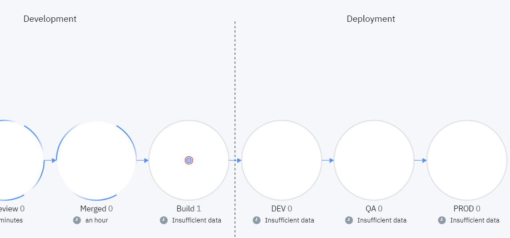

    - **Build -> DEV**
    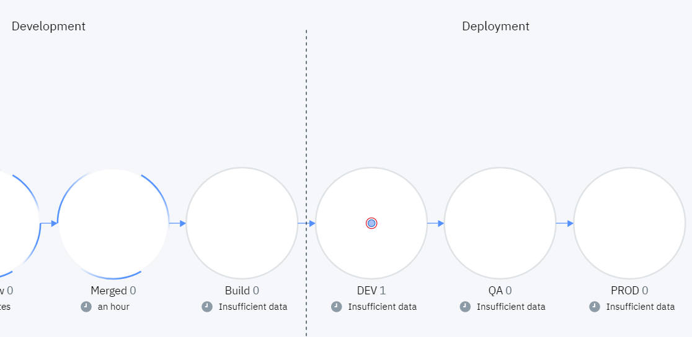

    - **DEV -> QA**
    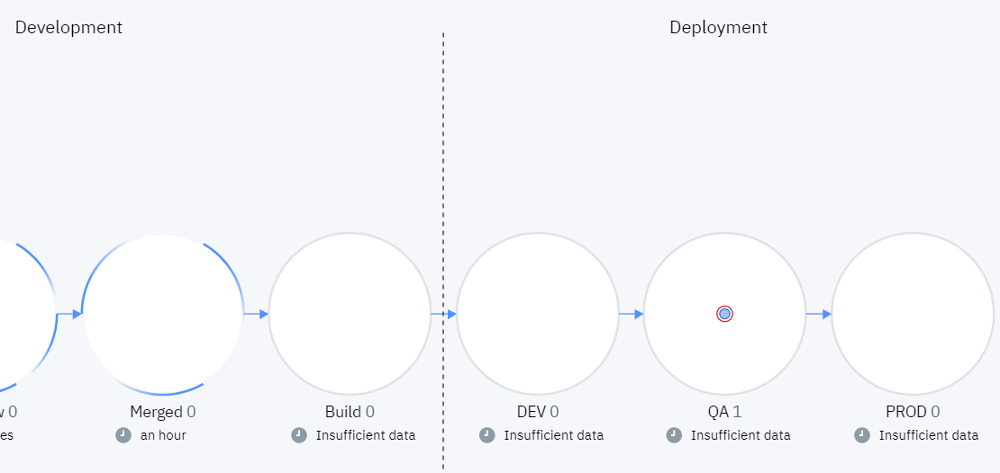

---

> 
>
>
> **Explanation**   
> For the inquisitive reader, the Jenkins script achieves this functionality as follows:
> <br/>
> <br/>
> 
> 1. **Build Stage**: The `UploadBuild` class is used to upload build data to UrbanCode Velocity. The `revision` parameter is important for linking the build to the work item via GitHub data (`GIT_COMMIT` in this case). The `versionName` is important for linking forward to deployments. The `appName` corresponds to the UrbanCode Velocity pipeline application name.
>  ```groovy
>  step($class: 'UploadBuild', 
>    tenantId: "5ade13625558f2c6688d15ce",
>    revision: "${GIT_COMMIT}",
>    appName: "${VELOCITY_APP_NAME}",
>    versionName:"${currentBuild.displayName}",
>    requestor: "admin", id: "${currentBuild.displayName}"
>  )
>  ```
>2. **Deployments (DEV and QA)**: The `UploadDeployment` class is used to upload deployment data to UrbanCode Velocity. The `versionName` parameter is critical for linking to build data. The `appName` corresponds to the UrbanCode Velocity pipeline application name, while `environmentName` and `environmentId` are used to identify the deployment environment.
>  ``` groovy
>  stage ("Deploy to DEV") {
>    sleep 20
>    step([$class: 'UploadDeployment',
>      tenantId: "5ade13625558f2c6688d15ce",
>      versionName: "${currentBuild.displayName}",
>      versionExtId: "${currentBuild.displayName}",
>      type: 'Jenkins',
>      environmentId: "${VELOCITY_ENV_ID_DEV}",
>      environmentName: 'DEV',
>      appName: "${VELOCITY_APP_NAME}",
>      description: '[Description ex: Terraform Deployment]',
>      initiator: "admin",
>      result: 'true'
>    ])
>  }
>  stage ("Deploy to QA") {
>    sleep 20
>    step([$class: 'UploadDeployment',
>      tenantId: "5ade13625558f2c6688d15ce",
>      versionName: "${currentBuild.displayName}",
>      versionExtId: "${currentBuild.displayName}",
>      type: 'Jenkins',
>      environmentId: "${VELOCITY_ENV_ID_QA}",
>      environmentName: 'QA',
>      appName: "${VELOCITY_APP_NAME}",
>      description: '[Description ex: Terraform Deployment]',
>      initiator: "admin",
>      result: 'true'
>    ])
>  }
>  ```

### 4.5.2 Deploying to Prod


#### 4.5.2.1 Create another Jenkins Job for Deployment to Prod

1. Create a second pipeline job, this time for deployment to our production environment.  
    
    


2. Make the pipeline job parameterized with a string parameter named "buildNumber".   
   

3. Copy and paste the script below as a pipeline script. The table below summarizes the variables you will need to provide within the script.

**Variable Name**|**Description**|**Example**
-----|-----|-----
VELOCITY\_ENV\_ID\_PROD|An ID that uniquely identifies your value stream's PROD environment|7a115f90-f4e5-4181-9920-78b216bb4afc
VELOCITY\_APP\_NAME|The Velocity pipeline application name (use "JKE App1" for the workbook, we will create this pipeline application later)|JKE App1

```groovy
parameters([
    string(name: 'buildNumber', description: 'The version of the application to deploy.')
])
node {
  //Get value for VELOCITY_ENV_ID_PROD from "Download attributes from API" json file.
  def VELOCITY_ENV_ID_PROD="<PROD ENVIRONMENT ID>"

  //VELOCITY_APP_NAME must match your Velocity pipeline application name
  def VELOCITY_APP_NAME="<VELOCITY PIPELINE APPLICATION NAME>"
 
 currentBuild.displayName = "${buildNumber}"
    stage ("Deploy to PROD") {
        step([$class: 'UploadDeployment',
            tenantId: "5ade13625558f2c6688d15ce",
            versionName: "${currentBuild.displayName}",
            versionExtId: "${currentBuild.displayName}",
            type: 'Jenkins',
            environmentId: "${VELOCITY_ENV_ID_PROD}",
            environmentName: 'PROD',
            appName: "${VELOCITY_APP_NAME}", 
            description: '[Description ex: Terraform Deployment]',
            initiator: "admin",
            result: 'true' 
        ])
    }
}
```

4. Click `Apply` and `Save` to save the pipeline job.
  
#### 4.5.2.2 Setting up a Pipeline to Deploy to Prod

1. Back in Velocity we will need a Jenkins job to provide version input to the pipeline.
   1. From the pipeline, click on the "+" underneath "Input" for the application of interest ("JKE App1" in this example).  
   
   1.  In the "Create Version" form choose "Automatically" and select the Jenkins job that is generating the build.  
   
   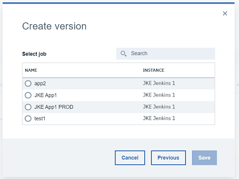

2. Map a Jenkins job to the UrbanCode Velocity pipeline environment for PROD.  
   1. From the pipeline, click on the "+" underneath "PROD" for the application of interest ("JKE App1" in this example).    
   
   2. Select the job we created for deploying to PROD and click "Save".  
   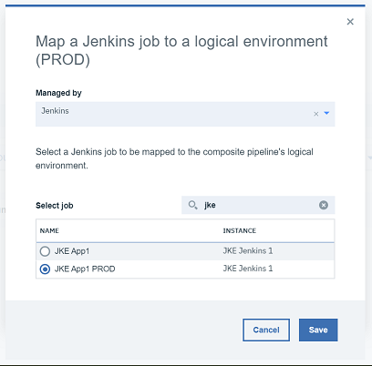
   1. We are going to link builds to deployments by passing the `buildNumber` as a parameter to a Jenkins job. Since we configured our job with parameters, we will be prompted at this point to provide them. Velocity has various version/inventory parameters on hand to support a fluid pipeline. In this case we'll enter `${version.buildNumber}` into the form.    
   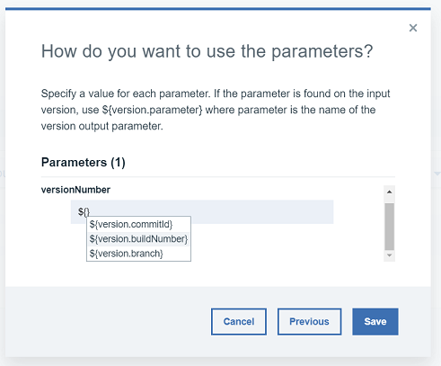

3. You should now see "Not yet Run" under both "Input" and "PROD" columns. Go ahead and run the first Jenkins job to provide new build information to UrbanCode Velocity. After running the input job you should see version information.   
  **Before Running Jenkins Job**   
  
  **After Running Jenkins Job**   
  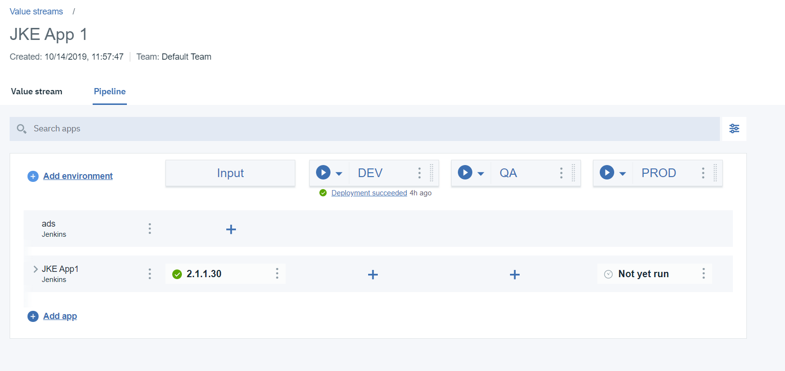

#### 4.5.2.3 Final Stage Change to PROD

1. From your UrbanCode Velocity pipeline, click on the "Play" button for PROD.   
   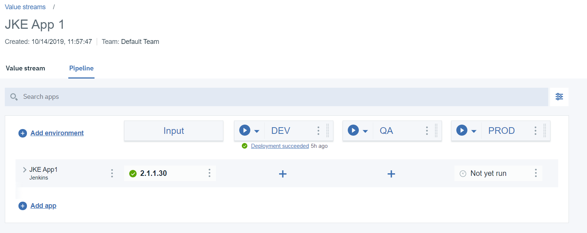
2. Select the latest version and click "Deploy". This will start the parameterized Jenkins job we created.   
   
3. After the job has finished the pipeline should show "Deployment succeeded" along with a version number.   
   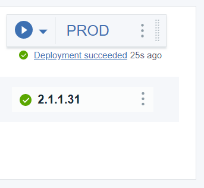
4. Going back to the value stream we should see the dot move all the way to PROD, its final stage.  
   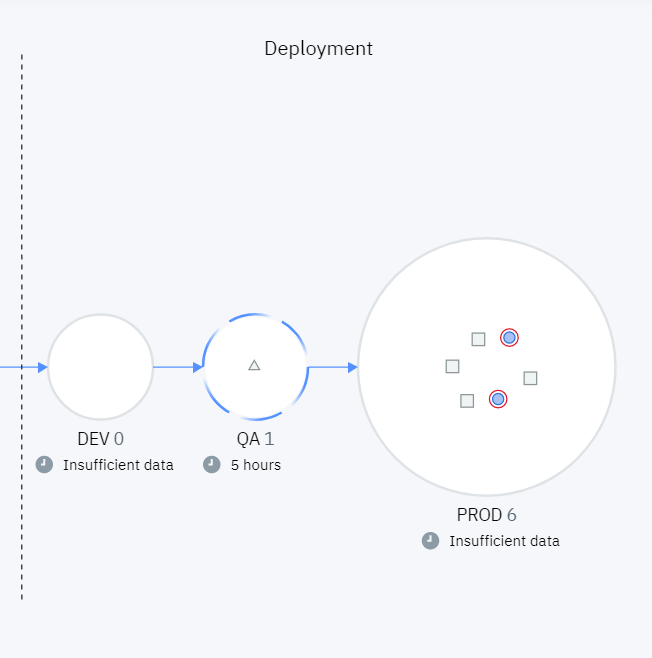

# 5. Conclusion

We have successfully navigated an entire value stream from backlog to production deployment spread across four separate tools and systems: three external tools (Jira, GitHub, and Jenkins), and Velocity itself as a deployment tool. We learned about key UrbanCode Velocity concepts such as the vsm.json file with its stage queries, integrations, and linkRules, as well as pipelines and deployments. From here you can go back and begin experimenting with your value stream. One good place to start is by looking at the vsm.json file stages and queries. From there you can begin to shape the value stream to match your own processes.

> *Questions or suggestions? Create an issue at [https://github.com/urbancode/velocity-info/issues](https://github.com/urbancode/velocity-info/issues)*

<!--
<figure class="video_container">
<iframe src="https://docs.google.com/presentation/d/e/2PACX-1vSLTVmu37ghdpeiOPh0nQrTRRSLMPRQ5eB9Gpd6c_9y63-WPpca4hyUab-gaoG-pNK54PI2uuE8MWRc/embed?start=true&loop=true&delayms=3000" frameborder="0" width="1440" height="839" allowfullscreen="true" mozallowfullscreen="true" webkitallowfullscreen="true"></iframe>
</figure>
-->
